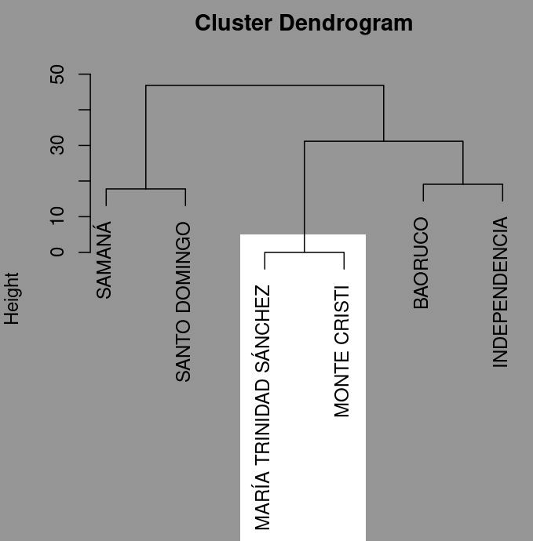
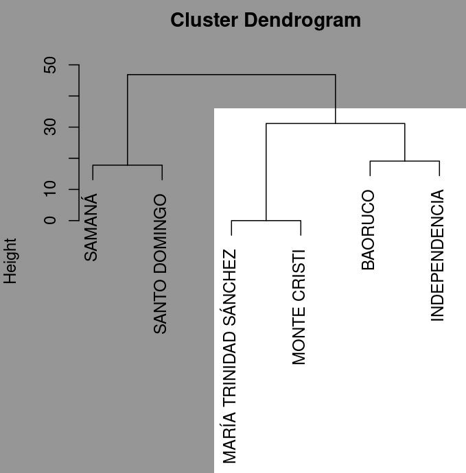

```{r setup, include=FALSE}
knitr::opts_chunk$set(
  echo = TRUE,
  warning = FALSE,
  message = FALSE,
  out.width = '100%',
  fig.retina = 4)
```

```{r, include=F}
output_format <- knitr::opts_knit$get("rmarkdown.pandoc.to")
repo_url <- system("git config --get remote.origin.url", intern = TRUE)
repo_name <- sub(".git$", "", basename(repo_url))
org_name <- basename(dirname(repo_url))
rmd_filename <- tools::file_path_sans_ext(basename(knitr::current_input()))
github_pages_url <- paste0("https://", org_name, ".github.io/", repo_name, "/", rmd_filename, ".html")
```

```{r, results='asis', echo=F}
if (grepl('gfm', output_format)) {
  cat('Versión HTML (quizá más legible), [aquí](', github_pages_url, ')\n', sep = '')
} else if (output_format == 'latex') {
  cat('Versión HTML (quizá más legible), [aquí](', github_pages_url, ')\n', sep = '')
}
```

# Fecha/hora de entrega

**04 de septiembre de 2024, 7:59 pm.**

# Introducción

La biogeografía examina patrones de diversidad biológica (en sentido amplio) en el espacio geográfico y a través del tiempo [@lomolino2006biogeography]. En este contexto, el análisis de la riqueza de especies por géneros de Bromeliaceae, puede ofrecer información valiosa sobre la diversidad y la riqueza relativa de especies en diferentes regiones geográficas. La familia Bromeliaceae, que incluye al género *Tillandsia*, presenta una alta diversidad en la República Dominicana y es un buen ejemplo para estudiar patrones biogeográficos. No obstante, los géneros monoespecíficos (representados por una especie), también son relevantes. Por esta razón, caracterizar cómo se agrupan las provincias según riqueza de especies de cada género, es un camino prometedor.

Para analizar cómo se agrupan las provincias dominicanas según la riqueza de especies por género, utilizaremos técnicas de agrupamiento jerárquico, como el método de agrupamiento jerárquico aglomerativo promedio no ponderado (UPGMA) [@borcard_numerical_2018]. Este método agrupa elementos, en este caso provincias, en función de sus características similares, permitiendo identificar patrones y relaciones entre diferentes unidades territoriales basadas en la riqueza relativa de especies.

En esta práctica, utilizaremos datos de riqueza relativa de especies por género de Bromeliaceae en diversas provincias. Usando datos de GBIF [@gbiforg2024what], me ocupé de calcular primero la riqueza relativa de especies por género en cada provincia, así que la tabla base ya está disponible. A título informativo, este mapa te muestra los registros de especies de la familia Bromeliaceae según GBIF:


Te pido dos cosas en esta práctica: 1) Evaluar tu rendimiento calculando distancia euclidiana usando los datos de riqueza relativa de especies de bromelias según género; 2) Aplicar el método de UPGMA para agrupar las provincias en función de estas características. Este enfoque te permitirá identificar agrupamientos naturales de provincias con riqueza de especies similares, facilitando la comprensión de la distribución biogeográfica de la familia Bromeliaceae.

# Ejercicio. Clasificar 6 provincias dominicanas según su riqueza relativa de especies por géneros de Bromeliaceae por el método de agrupamiento jerárquico aglomerativo promedio no ponderado (UPGMA)

## Objetivo

Agrupar provincias de la República Dominicana según su riqueza relativa de especies por géneros de Bromeliaceae utilizando el método de agrupamiento jerárquico aglomerativo promedio no ponderado (UPGMA), con el fin de identificar patrones biogeográficos comunes y diferenciar unidades territoriales en función de su diversidad de géneros.

## Planteamiento del Problema

Se dispone del archivo `data/riqueza_relativa_provincias_sf.gpkg`, que contiene la riqueza relativa de especies por género de Bromeliaceae en diferentes provincias de la República Dominicana, obtenido a partir de @martinez2022material. Usando estos datos realizarás un agrupamiento de las provincias según su riqueza relativa de especies por género de bromelias, aplicando el método de agrupamiento jerárquico UPGMA. Este agrupamiento permitirá identificar similitudes y diferencias en la riqueza relativa de especies por géneros entre las provincias, facilitando el análisis y la comprensión de los patrones biogeográficos a nivel regional.

## Obtención de los datos

> En lo adelante, se incluyen varios bloques de código. En la versión HTML, estos aparecen ocultos por defecto. Si deseas verlos, presiona el botón `Show`.

1. Cargar datos fuente. Los datos fueron obtenidos luego de procesar la fuente @martinez2022material.

Primero, es necesario cargar paquetes.

```{r}
library(tidyverse)
library(sf)
library(tmap)
library(cowplot)
```

Luego leemos los datos.

```{r}
prov <- st_read('data/riqueza_relativa_provincias_sf.gpkg', quiet = T) %>% 
  rename(nombre = TOPONIMIA) %>% select(-PROV, -REG, -ENLACE)
# Comprobar 100%
# prov %>% st_drop_geometry() %>% select(-(PROV:ENLACE)) %>% rowSums()
```

Una representación cartográfica te ayudará a ver las distribuciones porcentuales a lo largo del país.

```{r, include=F, echo=F, eval=F}
prov %>%
  pivot_longer(names_to = 'variable', values_to = 'value', -c(geom, nombre)) %>%
  tm_shape() +
  tm_fill(col='value', palette = "-BrBG", size = 0.1, style = 'fisher', n = 3,
          legend.is.portrait = T) +
  tm_borders(col = 'grey15', lwd = 0.3) +
  tm_facets(by = "variable", ncol = 4, nrow = 3, free.coords = FALSE, free.scales = TRUE) +
  tm_layout(
    panel.label.size = 1,
    panel.label.height = 0.5,
    legend.height = 0.3,
    legend.text.color = 'black',
    legend.width = 0.95,
    legend.text.size = 0.6, 
    legend.title.size = 0.001,
    legend.position = c('right', 'bottom'), 
    legend.frame = FALSE)
```


```{r}
# Transformar los datos
prov_long <- prov %>%
  pivot_longer(names_to = 'variable', values_to = 'value', -c(geom, nombre))

# Lista de variables únicas
variables <- unique(prov_long$variable)

# Crear mapas en gráficos separados, forzando la misma escala
maps <- map(variables, function(var) {
  prov_long %>%
    filter(variable == var) %>%
    ggplot(aes(fill = value, geometry = geom)) +
    geom_sf(color = 'grey15', size = 0.3) +
    scale_fill_distiller(palette = "BrBG", direction = -1, name = "Riqueza Relativa") +
    ggtitle(var) +
    theme_minimal() +
    theme(
      axis.text = element_blank(),
      axis.ticks = element_blank(),
      panel.grid.major = element_blank(),
      panel.grid.minor = element_blank(),
      legend.position = "bottom",
      legend.key.size = unit(0.4, "cm"), # Tamaño de los cuadrados de la leyenda
      legend.text = element_text(size = 6), # Tamaño del texto de la leyenda
      legend.title = element_text(size = 7), # Tamaño del título de la leyenda
      legend.spacing.x = unit(0.2, 'cm'), # Espaciado horizontal de la leyenda
      legend.spacing.y = unit(0.2, 'cm')  # Espaciado vertical de la leyenda

    )
})

# Combinar los mapas en una sola figura con leyenda común
combined_map <- plot_grid(plotlist = maps, labels = LETTERS[1:length(maps)], label_size = 10, nrow = 3)

# Mostrar el mapa combinado
print(combined_map)
```

2. **Creación de los 20 conjuntos** (reserva el conjunto 1 al Tali). Se han creado 20 conjuntos, cada uno de seis provincias elegidas al azar utilizando sus nombres.

```{r}
prov <- prov %>% filter(nombre != 'HERMANAS MIRABAL')
set.seed(123)
replicas <- replicate(20, sample(prov$nombre, 6))
df <- data.frame(Conjunto = 1:20, t(replicas))
df %>%
  unite("Provincias asignadas", X1:X6, sep = ", ") %>% 
  knitr::kable()
```

3. **Presentación de los datos crudos de cada uno de los 20 conjuntos**. Esta matriz contiene la riqueza relativa (en tanto por ciento) de especies de bromelias según género de la base de datos GBIF [@gbiforg2024what]. Con esta matriz podrás hacer un cálculo de distancia (parte 1 del mandato, que verás en la siguiente sección).

```{r}
conjuntos_l <- sapply(1:ncol(replicas),
       function(x)
         prov %>%
         filter(nombre %in% replicas[, x]) %>% st_drop_geometry(),
       simplify = F) %>%
  setNames(paste0('Conjunto ', 1:20))
conjuntos_l_k <- lapply(
  conjuntos_l,
  function(x) {
    colnames(x) <- gsub('\\n', '', colnames(x))
    knitr::kable(x, digits = 2, align = 'c')
    })
```


```{r, results='asis'}
# Imprimir tablas
for (tabla in 1:length(conjuntos_l_k)) {
  cat('Conjunto', tabla, "\n\n")
  print(conjuntos_l_k[[tabla]])
  cat("\n\n")
}
```

4. **Generación de la matriz de distancias de cada uno de los 20 conjuntos**. Esta es la matriz de distancias con la que podrás realizar el agrupamiento jerárquico UPGMA (parte 2 del mandato, que verás en la siguiente sección).

```{r, results='asis'}
# Mostrar las matrices de distancia
print(sapply(
  conjuntos_l,
  function(x) {
    x %>%
      as.data.frame() %>%
      column_to_rownames('nombre') %>%
      dist(diag = T, upper = T) %>% 
      as.matrix() %>% 
      as.data.frame() %>% 
      knitr::kable(digits = 2, align = 'c')
  },
  simplify = F))
```

## **Mandato**.

> Ten presente un aspecto importante. El Tali te provee la matriz de distancias para que realices el agrupamiento (parte 2 de este mandato). Sin embargo, el Tali también te pide, en la parte 1 de este mandato que, a modo de prueba, calcules la distancia euclidiana para dos pares de provincias elegidos al azar de entre los 15 posibles. Esto tiene por objetivo que puedas medir tu rendimiento en el cálculo de distancias en un espacio n-dimensional.

> Los cálculos se pueden realizar a mano o con una calculadora del teléfono, utilizando las fórmulas proporcionadas.

1. Usando los datos generados por @martinez2022material, para el conjunto que te tocó (recuerda reservar el conjunto 1 al Tali), obtén la distancia euclidiana entre un par de provincias elegidas por ti al azar (tienes que analizar 6 provincias, elige un par al azar). Haz este cálculo usando todas las dimensiones (atributos) disponibles (doce en total). Ten presente que, para incluir las doce dimensiones, deberás usar la fórmula generalizada de la distancia que verás en el ejemplo práctico, la cual considera un espacio n-dimensional (es decir, sumando los cuadrados de las diferencias entre sus coordenadas correspondientes en cada una de las doce dimensiones, y tomando la raíz cuadrada del resultado). **Esta parte del ejercicio es obligatoria, pero no es imprescindible para realizar la segunda parte**, y lo único que quiero es verificar tu rendimiento para calcular distancias en un espacio n-dimensional, donde n>3. Es decir, no te estoy pidiendo que hagas esta parte 1 para poder hacer la 2. Simplemente, quiero que calcules distancias. Además, ten presente que tu cálculo lo podrás comprobar con el que se encuentra en la matriz de distancias ya calculada.

2. Aplica el método de agrupamiento jerárquico aglomerativo promedio no ponderado (UPGMA) para agrupar las provincias según su riqueza relativa de especies por género de bromelias, usando la matriz de distancias provista arriba.

3. Redacta, en un máximo de cuatro párrafos, lo siguiente:

  - Introducción, en el que podrías incluir importancia del ejercicio, objetivo, justificación.
  - Materiales y métodos, donde resumas que materiales usaste (esto incluye hasta el teléfono móvil, papel, lápiz, etc.), y las técnicas específicas empleadas, que en tu caso son la distancia y el método de agrupamiento enseñado.
  - Resultado, lo cual supone describir, fríamente, lo que obtuviste.
  - Discusión, donde indiques si alcanzaste el objetivo, interpretes el resultado, indiques las limitaciones y los posibles trabajos futuros.

# Ejemplo práctico

## Parte 1. Calcular distancia entre dos provincias.

> Recuerda: esta parte es obligatoria, pero no es un imprescindible para realizar la parte 2. Sólo me interesa que verifiques tu rendimiento calculando distancias en un espacio n-dimensional, donde en este caso n=12.

Vamos a calcular la distancia euclidiana entre las provincias **BAORUCO** e **INDEPENDENCIA** utilizando las doce dimensiones proporcionadas en los datos del Conjunto 1, que representan las proporciones de especies de Bromeliaceae por género en cada provincia.

### Paso a Paso para Calcular la Distancia Euclidiana

La fórmula para la distancia euclidiana es:

\[
d(A, B) = \sqrt{\sum_{i=1}^{n} (x_{i} - y_{i})^2}
\]

donde:
- \( d(A, B) \) es la distancia euclidiana entre las provincias **BAORUCO** e **INDEPENDENCIA**.
- \( x_{i} \) y \( y_{i} \) son las proporciones de especies para las provincias **BAORUCO** e **INDEPENDENCIA**, respectivamente.
- \( n = 12 \) es el número de géneros considerados.

### Cálculo Paso a Paso

| Género         | BAORUCO (\( x_i \)) | INDEPENDENCIA (\( y_i \)) | \( (x_i - y_i)^2 \)                  |
|:---------------|---------------------:|---------------------------:|-------------------------------------:|
| Bromelia       | 0.000000             | 0.000000                   | \( (0.000000 - 0.000000)^2 = 0 \)    |
| Catopsis       | 0.000000             | 10.526316                  | \( (0.000000 - 10.526316)^2 = 110.81 \) |
| Tillandsia     | 76.92308             | 68.42105                   | \( (76.92308 - 68.42105)^2 = 72.42 \)  |
| Guzmania       | 7.692308             | 0.000000                   | \( (7.692308 - 0.000000)^2 = 59.20 \)  |
| Pitcairnia     | 7.692308             | 10.526316                  | \( (7.692308 - 10.526316)^2 = 8.03 \)  |
| Racinaea       | 7.692308             | 0.000000                   | \( (7.692308 - 0.000000)^2 = 59.20 \)  |
| Aechmea        | 0.000000             | 0.000000                   | \( (0.000000 - 0.000000)^2 = 0 \)    |
| Ananas         | 0.000000             | 0.000000                   | \( (0.000000 - 0.000000)^2 = 0 \)    |
| Cipuropsis     | 0.000000             | 0.000000                   | \( (0.000000 - 0.000000)^2 = 0 \)    |
| Werauhia       | 0.000000             | 5.263158                   | \( (0.000000 - 5.263158)^2 = 27.69 \) |
| Zizkaea        | 0.000000             | 5.263158                   | \( (0.000000 - 5.263158)^2 = 27.69 \) |
| Billbergia     | 0.000000             | 0.000000                   | \( (0.000000 - 0.000000)^2 = 0 \)    |

### Suma de las Diferencias al Cuadrado

\[
\sum_{i=1}^{12} (x_{i} - y_{i})^2 = 0 + 110.81 + 72.42 + 59.20 + 8.03 + 59.20 + 0 + 0 + 0 + 27.69 + 27.69 + 0 = 365.04
\]

### Cálculo de la Distancia Euclidiana

\[
d(\text{BAORUCO, INDEPENDENCIA}) = \sqrt{365.04} \approx 19.11
\]

### Resultado

La distancia euclidiana entre las provincias **BAORUCO** e **INDEPENDENCIA** es aproximadamente **19.11** unidades porcentuales. Esta distancia refleja la magnitud de la diferencia en la distribución de géneros de Bromeliaceae entre las dos provincias consideradas.

## Parte 2. Aplicar el método UPGMA

Para realizar un agrupamiento jerárquico utilizando el método de agrupamiento jerárquico aglomerativo promedio no ponderado (UPGMA), seguimos un enfoque iterativo que consiste en agrupar los pares de elementos o clusters más cercanos hasta que todos los elementos estén en un único cluster. UPGMA utiliza las distancias promedio entre todos los miembros de los clusters para calcular la distancia entre clusters. [Este vídeo](https://www.youtube.com/watch?v=RdT7bhm1M3E) también podría resultarte útil, aunque en el vídeo, la instructora se basa en el vínculo simple, no en el promedio; es decir, ella, en lugar de obtener promedios a la hora de recalcular la matriz de distancias, lo que obtiene son valores mínimos, pero en nuestro casos serían promedios.

```{r, echo=F, include=F}
conjuntos_l_1 <- conjuntos_l[[1]]
dist_conj_1 <- conjuntos_l_1 %>%
  as.data.frame() %>%
  column_to_rownames('nombre') %>%
  dist(diag = T, upper = T)
conj_1_upgma <- hclust(dist_conj_1, method = 'average')
plot(conj_1_upgma)
```

### Matriz de Distancias Inicial

Dado el conjunto de datos del Conjunto 1, su matriz de distancia es:

|                       | BAORUCO | INDEPENDENCIA | MARÍA TRINIDAD SÁNCHEZ | MONTE CRISTI | SAMANÁ | SANTO DOMINGO |
|:----------------------|:-------:|:-------------:|:----------------------:|:------------:|:------:|:-------------:|
|BAORUCO                |  0.00   |     19.10     |         26.65          |    26.65     | 43.35  |     32.60     |
|INDEPENDENCIA          |  19.10  |     0.00      |         35.70          |    35.70     | 33.88  |     24.38     |
|MARÍA TRINIDAD SÁNCHEZ |  26.65  |     35.70     |          0.00          |     0.00     | 66.33  |     54.01     |
|MONTE CRISTI           |  26.65  |     35.70     |          0.00          |     0.00     | 66.33  |     54.01     |
|SAMANÁ                 |  43.35  |     33.88     |         66.33          |    66.33     |  0.00  |     17.80     |
|SANTO DOMINGO          |  32.60  |     24.38     |         54.01          |    54.01     | 17.80  |     0.00      |


### Paso 1: Encuentra el par con la distancia más pequeña

- El par con la distancia más pequeña es **MARÍA TRINIDAD SÁNCHEZ** y **MONTE CRISTI** con una distancia de 0.0. Este par forma el primer grupo (MTS-MC).

{width='40%'}

- Calculamos la distancia entre este nuevo cluster (MTS-MC) y los otros elementos utilizando el promedio de las distancias:

\[
\text{Distancia}(MTS-MC, \text{BAORUCO}) = \frac{26.65 + 26.65}{2} = 26.65
\]

\[
\text{Distancia}(MTS-MC, \text{INDEPENDENCIA}) = \frac{35.70 + 35.70}{2} = 35.70
\]

\[
\text{Distancia}(MTS-MC, \text{SAMANÁ}) = \frac{66.33 + 66.33}{2} = 66.33
\]

\[
\text{Distancia}(MTS-MC, \text{SANTO DOMINGO}) = \frac{54.01 + 54.01}{2} = 54.01
\]

- Nueva matriz de distancias:

|                  | MTS-MC | BAORUCO | INDEPENDENCIA | SAMANÁ | SANTO DOMINGO |
|------------------|--------|---------|---------------|--------|---------------|
| **MTS-MC**       |        | 26.65   | 35.70         | 66.33  | 54.01         |
| **BAORUCO**      | 26.65  |         | 19.10         | 43.35  | 32.60         |
| **INDEPENDENCIA**| 35.70  | 19.10   |               | 33.88  | 24.38         |
| **SAMANÁ**       | 66.33  | 43.35   | 33.88         |        | 17.80         |
| **SANTO DOMINGO**| 54.01  | 32.60   | 24.38         | 17.80  |               |

### Paso 2: Encuentra el Siguiente Par con la Distancia más Pequeña

- El siguiente par con la distancia más pequeña es **SAMANÁ** y **SANTO DOMINGO** con una distancia de 17.80.

### Paso 3: Agrupa el Nuevo Cluster

- Agrupamos **SAMANÁ** y **SANTO DOMINGO** en un nuevo cluster (SAM-SD).

{width='40%'}

- Calculamos la distancia entre el nuevo cluster (SAM-SD) y los otros elementos:

\[
\text{Distancia}(SAM-SD, \text{MTS-MC}) = \frac{66.33 + 54.01}{2} = 60.17
\]

\[
\text{Distancia}(SAM-SD, \text{BAORUCO}) = \frac{43.35 + 32.60}{2} = 37.98
\]

\[
\text{Distancia}(SAM-SD, \text{INDEPENDENCIA}) = \frac{33.88 + 24.38}{2} = 29.13
\]

- Nueva matriz de distancias:

|                  | MTS-MC | BAORUCO | INDEPENDENCIA | SAM-SD |
|------------------|--------|---------|---------------|--------|
| **MTS-MC**       |        | 26.65   | 35.70         | 60.17  |
| **BAORUCO**      | 26.65  |         | 19.10         | 37.98  |
| **INDEPENDENCIA**| 35.70  | 19.10   |               | 29.13  |
| **SAM-SD**       | 60.17  | 37.98   | 29.13         |        |

### Paso 4: Encuentra el Siguiente Par con la Distancia más Pequeña

- El siguiente par con la distancia más pequeña es **BAORUCO** e **INDEPENDENCIA** con una distancia de 19.10.

### Paso 5: Agrupa el Nuevo Cluster

- Agrupamos **BAORUCO** e **INDEPENDENCIA** en un nuevo cluster (BA-IND).

{width='40%'}

- Calculamos la distancia entre el nuevo cluster (BA-IND) y los otros elementos:

\[
\text{Distancia}(BA-IND, \text{MTS-MC}) = \frac{26.65 + 35.70}{2} = 31.18
\]

\[
\text{Distancia}(BA-IND, \text{SAM-SD}) = \frac{37.98 + 29.13}{2} = 33.56
\]

- Nueva matriz de distancias:

|                  | MTS-MC | BA-IND | SAM-SD |
|------------------|--------|--------|--------|
| **MTS-MC**       |        | 31.18  | 60.17  |
| **BA-IND**       | 31.18  |        | 33.56  |
| **SAM-SD**       | 60.17  | 33.56  |        |

### Paso 6: Encuentra el Siguiente Par con la Distancia más Pequeña

- El siguiente par con la distancia más pequeña es **MTS-MC** y **BA-IND** con una distancia de 31.18.

### Paso 7: Agrupa el Nuevo Cluster

- Agrupamos **MTS-MC** y **BA-IND** en un nuevo cluster (MTS-MC-BA-IND).

{width='40%'}

- Calculamos la distancia entre el nuevo cluster (MTS-MC-BA-IND) y el otro elemento:

\[
\text{Distancia}(MTS-MC-BA-IND, \text{SAM-SD}) = \frac{60.17 + 33.56}{2} = 46.87
\]

- Nueva matriz de distancias:

|                  | MTS-MC-BA-IND | SAM-SD |
|------------------|---------------|--------|
| **MTS-MC-BA-IND**|               | 46.87  |
| **SAM-SD**       | 46.87         |        |

### Paso 8: Agrupa los Últimos Clusters

- Finalmente, agrupamos **MTS-MC-BA-IND** y **SAM-SD** con una distancia de 46.87.

{width='40%'}

### Dendrograma

El resultado final del proceso es un dendrograma que muestra la estructura jerárquica completa de los agrupamientos hasta que todos los elementos quedan en un solo cluster.

###  Conclusión

En resumen, el método UPGMA aplicado a las provincias dominicanas revela agrupamientos basados en la similitud de la riqueza relativa de especies de Bromeliaceae. Este enfoque jerárquico facilita la identificación de patrones biogeográficos y destaca las relaciones entre provincias con características comunes, lo que es útil para estudios de biodiversidad y planificación de conservación.

# ¿Cómo se haría el ejemplo práctico en R?

```{r, eval = F, echo = T}
conjuntos_l_1 <- conjuntos_l[[1]]
dist_conj_1 <- conjuntos_l_1 %>%
  as.data.frame() %>%
  column_to_rownames('nombre') %>%
  dist(diag = T, upper = T)
conj_1_upgma <- hclust(dist_conj_1, method = 'average')
plot(conj_1_upgma)
```

## Referencias

