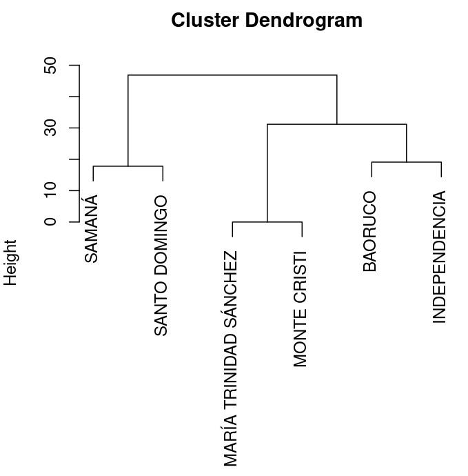

Prácticas de aula 3 (PA03). Agrupar provincias según su riqueza relativa
de especies por géneros de Bromeliaceae<small><br>Biogeografía
(GEO-131)<br>Universidad Autónoma de Santo Domingo (UASD)<br>Semestre
2024-02</small>
================
El Tali
2024-09-03

Versión HTML (quizá más legible),
[aquí](https://biogeografia-master.github.io/agrupamiento-por-riqueza/README.html)

# Fecha/hora de entrega

**04 de septiembre de 2024, 7:59 pm.**

# Introducción

La biogeografía examina patrones de diversidad biológica (en sentido
amplio) en el espacio geográfico y a través del tiempo (Lomolino et al.
2006). En este contexto, el análisis de la riqueza de especies por
géneros de Bromeliaceae, puede ofrecer información valiosa sobre la
diversidad y la riqueza relativa de especies en diferentes regiones
geográficas. La familia Bromeliaceae, que incluye al género
*Tillandsia*, presenta una alta diversidad en la República Dominicana y
es un buen ejemplo para estudiar patrones biogeográficos. No obstante,
los géneros monoespecíficos (representados por una especie), también son
relevantes. Por esta razón, caracterizar cómo se agrupan las provincias
según riqueza de especies de cada género, es un camino prometedor.

Para analizar cómo se agrupan las provincias dominicanas según la
riqueza de especies por género, utilizaremos técnicas de agrupamiento
jerárquico, como el método de agrupamiento jerárquico aglomerativo
promedio no ponderado (UPGMA) (Borcard, Gillet, and Legendre 2018). Este
método agrupa elementos, en este caso provincias, en función de sus
características similares, permitiendo identificar patrones y relaciones
entre diferentes unidades territoriales basadas en la riqueza relativa
de especies.

En esta práctica, utilizaremos datos de riqueza relativa de especies por
género de Bromeliaceae en diversas provincias. Usando datos de GBIF
(GBIF.org 2024), me ocupé de calcular primero la riqueza relativa de
especies por género en cada provincia, así que la tabla base ya está
disponible. A título informativo, este mapa te muestra los registros de
especies de la familia Bromeliaceae según GBIF:


Te pido dos cosas en esta práctica: 1) Evaluar tu rendimiento calculando
distancia euclidiana usando los datos de riqueza relativa de especies de
bromelias según género; 2) Aplicar el método de UPGMA para agrupar las
provincias en función de estas características. Este enfoque te
permitirá identificar agrupamientos naturales de provincias con riqueza
de especies similares, facilitando la comprensión de la distribución
biogeográfica de la familia Bromeliaceae.

# Ejercicio. Clasificar 6 provincias dominicanas según su riqueza relativa de especies por géneros de Bromeliaceae por el método de agrupamiento jerárquico aglomerativo promedio no ponderado (UPGMA)

## Objetivo

Agrupar provincias de la República Dominicana según su riqueza relativa
de especies por géneros de Bromeliaceae utilizando el método de
agrupamiento jerárquico aglomerativo promedio no ponderado (UPGMA), con
el fin de identificar patrones biogeográficos comunes y diferenciar
unidades territoriales en función de su diversidad de géneros.

## Planteamiento del Problema

Se dispone del archivo `data/riqueza_relativa_provincias_sf.gpkg`, que
contiene la riqueza relativa de especies por género de Bromeliaceae en
diferentes provincias de la República Dominicana, obtenido a partir de
Martínez-Batlle (2022). Usando estos datos realizarás un agrupamiento de
las provincias según su riqueza relativa de especies por género de
bromelias, aplicando el método de agrupamiento jerárquico UPGMA. Este
agrupamiento permitirá identificar similitudes y diferencias en la
riqueza relativa de especies por géneros entre las provincias,
facilitando el análisis y la comprensión de los patrones biogeográficos
a nivel regional.

## Obtención de los datos

> En lo adelante, se incluyen varios bloques de código. En la versión
> HTML, estos aparecen ocultos por defecto. Si deseas verlos, presiona
> el botón `Show`.

1.  Cargar datos fuente. Los datos fueron obtenidos luego de procesar la
    fuente Martínez-Batlle (2022).

Primero, es necesario cargar paquetes.

``` r
library(tidyverse)
library(sf)
library(tmap)
library(cowplot)
```

Luego leemos los datos.

``` r
prov <- st_read('data/riqueza_relativa_provincias_sf.gpkg', quiet = T) %>% 
  rename(nombre = TOPONIMIA) %>% select(-PROV, -REG, -ENLACE)
# Comprobar 100%
# prov %>% st_drop_geometry() %>% select(-(PROV:ENLACE)) %>% rowSums()
```

Una representación cartográfica te ayudará a ver las distribuciones
porcentuales a lo largo del país.

``` r
# Transformar los datos
prov_long <- prov %>%
  pivot_longer(names_to = 'variable', values_to = 'value', -c(geom, nombre))

# Lista de variables únicas
variables <- unique(prov_long$variable)

# Crear mapas en gráficos separados, forzando la misma escala
maps <- map(variables, function(var) {
  prov_long %>%
    filter(variable == var) %>%
    ggplot(aes(fill = value, geometry = geom)) +
    geom_sf(color = 'grey15', size = 0.3) +
    scale_fill_distiller(palette = "BrBG", direction = -1, name = "Riqueza Relativa") +
    ggtitle(var) +
    theme_minimal() +
    theme(
      axis.text = element_blank(),
      axis.ticks = element_blank(),
      panel.grid.major = element_blank(),
      panel.grid.minor = element_blank(),
      legend.position = "bottom",
      legend.key.size = unit(0.4, "cm"), # Tamaño de los cuadrados de la leyenda
      legend.text = element_text(size = 6), # Tamaño del texto de la leyenda
      legend.title = element_text(size = 7), # Tamaño del título de la leyenda
      legend.spacing.x = unit(0.2, 'cm'), # Espaciado horizontal de la leyenda
      legend.spacing.y = unit(0.2, 'cm')  # Espaciado vertical de la leyenda

    )
})

# Combinar los mapas en una sola figura con leyenda común
combined_map <- plot_grid(plotlist = maps, labels = LETTERS[1:length(maps)], label_size = 10, nrow = 3)

# Mostrar el mapa combinado
print(combined_map)
```


2.  **Creación de los 20 conjuntos** (reserva el conjunto 1 al Tali). Se
    han creado 20 conjuntos, cada uno de seis provincias elegidas al
    azar utilizando sus nombres.

``` r
prov <- prov %>% filter(nombre != 'HERMANAS MIRABAL')
set.seed(123)
replicas <- replicate(20, sample(prov$nombre, 6))
df <- data.frame(Conjunto = 1:10, t(replicas))
df %>%
  unite("Provincias asignadas", X1:X6, sep = ", ") %>% 
  knitr::kable()
```

| Conjunto | Provincias asignadas                                                                                         |
|---------:|:-------------------------------------------------------------------------------------------------------------|
|        1 | SANTO DOMINGO, MONTE CRISTI, SAMANÁ, MARÍA TRINIDAD SÁNCHEZ, BAORUCO, INDEPENDENCIA                          |
|        2 | PUERTO PLATA, SAN PEDRO DE MACORÍS, LA ALTAGRACIA, DAJABÓN, SAN CRISTÓBAL, MARÍA TRINIDAD SÁNCHEZ            |
|        3 | SAN PEDRO DE MACORÍS, SANTIAGO RODRÍGUEZ, VALVERDE, MONSEÑOR NOUEL, DAJABÓN, SAMANÁ                          |
|        4 | MONSEÑOR NOUEL, SANTIAGO RODRÍGUEZ, MONTE PLATA, SAN JOSÉ DE OCOA, ESPAILLAT, BAORUCO                        |
|        5 | EL SEIBO, VALVERDE, ELÍAS PIÑA, INDEPENDENCIA, ESPAILLAT, SAMANÁ                                             |
|        6 | BARAHONA, MARÍA TRINIDAD SÁNCHEZ, PERAVIA, LA ALTAGRACIA, ELÍAS PIÑA, SAN JUAN                               |
|        7 | LA ROMANA, MONTE CRISTI, INDEPENDENCIA, LA VEGA, ELÍAS PIÑA, ESPAILLAT                                       |
|        8 | ESPAILLAT, INDEPENDENCIA, SANCHEZ RAMÍREZ, MONSEÑOR NOUEL, SAN JUAN, ELÍAS PIÑA                              |
|        9 | SAN JUAN, MONSEÑOR NOUEL, DUARTE, SANTIAGO RODRÍGUEZ, AZUA, DAJABÓN                                          |
|       10 | EL SEIBO, LA ROMANA, LA VEGA, PUERTO PLATA, DISTRITO NACIONAL, SANTIAGO RODRÍGUEZ                            |
|        1 | MONSEÑOR NOUEL, SANTIAGO RODRÍGUEZ, DUARTE, SAN JUAN, MONTE CRISTI, ESPAILLAT                                |
|        2 | MONTE CRISTI, VALVERDE, MONTE PLATA, PEDERNALES, SAN CRISTÓBAL, DUARTE                                       |
|        3 | LA ALTAGRACIA, EL SEIBO, SAN PEDRO DE MACORÍS, HATO MAYOR, ELÍAS PIÑA, PEDERNALES                            |
|        4 | PERAVIA, SAN PEDRO DE MACORÍS, PUERTO PLATA, SANTO DOMINGO, AZUA, BARAHONA                                   |
|        5 | LA VEGA, DAJABÓN, SAN PEDRO DE MACORÍS, SAMANÁ, SANTIAGO RODRÍGUEZ, SAN CRISTÓBAL                            |
|        6 | SAN PEDRO DE MACORÍS, SANTIAGO RODRÍGUEZ, MARÍA TRINIDAD SÁNCHEZ, SAN JOSÉ DE OCOA, SANCHEZ RAMÍREZ, BAORUCO |
|        7 | EL SEIBO, PEDERNALES, LA ROMANA, SANTIAGO RODRÍGUEZ, MARÍA TRINIDAD SÁNCHEZ, BAORUCO                         |
|        8 | MARÍA TRINIDAD SÁNCHEZ, HATO MAYOR, ELÍAS PIÑA, BAORUCO, SANCHEZ RAMÍREZ, SAN PEDRO DE MACORÍS               |
|        9 | VALVERDE, MONTE CRISTI, SAN JUAN, DAJABÓN, EL SEIBO, SAMANÁ                                                  |
|       10 | INDEPENDENCIA, PUERTO PLATA, SANTO DOMINGO, LA ROMANA, AZUA, HATO MAYOR                                      |

3.  **Presentación de los datos crudos de cada uno de los 20
    conjuntos**. Esta matriz contiene la riqueza relativa (en tanto por
    ciento) de especies de bromelias según género de la base de datos
    GBIF (GBIF.org 2024). Con esta matriz podrás hacer un cálculo de
    distancia (parte 1 del mandato, que verás en la siguiente sección).

``` r
conjuntos_l <- sapply(1:ncol(replicas),
       function(x)
         prov %>%
         filter(nombre %in% replicas[, x]) %>% st_drop_geometry(),
       simplify = F) %>%
  setNames(paste0('Conjunto ', 1:20))
conjuntos_l_k <- lapply(
  conjuntos_l,
  function(x) {
    colnames(x) <- gsub('\\n', '', colnames(x))
    knitr::kable(x, digits = 2, align = 'c')
    })
```

``` r
# Imprimir tablas
for (tabla in 1:length(conjuntos_l_k)) {
  cat('Conjunto', tabla, "\n\n")
  print(conjuntos_l_k[[tabla]])
  cat("\n\n")
}
```

Conjunto 1

|         nombre         | Bromelia | Catopsis | Tillandsia | Guzmania | Pitcairnia | Racinaea | Aechmea | Ananas | Cipuropsis | Werauhia | Zizkaea | Billbergia |
|:----------------------:|:--------:|:--------:|:----------:|:--------:|:----------:|:--------:|:-------:|:------:|:----------:|:--------:|:-------:|:----------:|
|        BAORUCO         |   0.00   |   0.00   |   76.92    |   7.69   |    7.69    |   7.69   |    0    |  0.00  |     0      |   0.00   |  0.00   |     0      |
|     INDEPENDENCIA      |   0.00   |  10.53   |   68.42    |   0.00   |   10.53    |   0.00   |    0    |  0.00  |     0      |   5.26   |  5.26   |     0      |
| MARÍA TRINIDAD SÁNCHEZ |   0.00   |   0.00   |   100.00   |   0.00   |    0.00    |   0.00   |    0    |  0.00  |     0      |   0.00   |  0.00   |     0      |
|      MONTE CRISTI      |   0.00   |   0.00   |   100.00   |   0.00   |    0.00    |   0.00   |    0    |  0.00  |     0      |   0.00   |  0.00   |     0      |
|         SAMANÁ         |   0.00   |  10.00   |   40.00    |  10.00   |   20.00    |   0.00   |    0    | 10.00  |     0      |   0.00   |  10.00  |     0      |
|     SANTO DOMINGO      |   8.33   |   8.33   |   50.00    |   8.33   |    8.33    |   0.00   |    0    |  8.33  |     0      |   0.00   |  8.33   |     0      |

Conjunto 2

|         nombre         | Bromelia | Catopsis | Tillandsia | Guzmania | Pitcairnia | Racinaea | Aechmea | Ananas | Cipuropsis | Werauhia | Zizkaea | Billbergia |
|:----------------------:|:--------:|:--------:|:----------:|:--------:|:----------:|:--------:|:-------:|:------:|:----------:|:--------:|:-------:|:----------:|
|        DAJABÓN         |   0.00   |   0.00   |   100.00   |   0.00   |    0.00    |    0     |    0    |  0.00  |     0      |    0     |  0.00   |    0.00    |
|     LA ALTAGRACIA      |   7.69   |   0.00   |   76.92    |  15.38   |    0.00    |    0     |    0    |  0.00  |     0      |    0     |  0.00   |    0.00    |
| MARÍA TRINIDAD SÁNCHEZ |   0.00   |   0.00   |   100.00   |   0.00   |    0.00    |    0     |    0    |  0.00  |     0      |    0     |  0.00   |    0.00    |
|      PUERTO PLATA      |   7.14   |  14.29   |   57.14    |   7.14   |    7.14    |    0     |    0    |  0.00  |     0      |    0     |  0.00   |    7.14    |
|     SAN CRISTÓBAL      |   6.25   |   0.00   |   68.75    |   6.25   |    6.25    |    0     |    0    |  6.25  |     0      |    0     |  6.25   |    0.00    |
|  SAN PEDRO DE MACORÍS  |  25.00   |   0.00   |   75.00    |   0.00   |    0.00    |    0     |    0    |  0.00  |     0      |    0     |  0.00   |    0.00    |

Conjunto 3

|        nombre        | Bromelia | Catopsis | Tillandsia | Guzmania | Pitcairnia | Racinaea | Aechmea | Ananas | Cipuropsis | Werauhia | Zizkaea | Billbergia |
|:--------------------:|:--------:|:--------:|:----------:|:--------:|:----------:|:--------:|:-------:|:------:|:----------:|:--------:|:-------:|:----------:|
|       DAJABÓN        |   0.00   |   0.00   |   100.00   |   0.00   |    0.00    |    0     |    0    |   0    |     0      |   0.00   |  0.00   |     0      |
|        SAMANÁ        |   0.00   |  10.00   |   40.00    |  10.00   |   20.00    |    0     |    0    |   10   |     0      |   0.00   |  10.00  |     0      |
| SAN PEDRO DE MACORÍS |  25.00   |   0.00   |   75.00    |   0.00   |    0.00    |    0     |    0    |   0    |     0      |   0.00   |  0.00   |     0      |
|  SANTIAGO RODRÍGUEZ  |   0.00   |   9.09   |   90.91    |   0.00   |    0.00    |    0     |    0    |   0    |     0      |   0.00   |  0.00   |     0      |
|       VALVERDE       |   0.00   |  14.29   |   71.43    |   0.00   |   14.29    |    0     |    0    |   0    |     0      |   0.00   |  0.00   |     0      |
|    MONSEÑOR NOUEL    |   4.35   |  13.04   |   56.52    |   4.35   |   13.04    |    0     |    0    |   0    |     0      |   4.35   |  4.35   |     0      |

Conjunto 4

|       nombre       | Bromelia | Catopsis | Tillandsia | Guzmania | Pitcairnia | Racinaea | Aechmea | Ananas | Cipuropsis | Werauhia | Zizkaea | Billbergia |
|:------------------:|:--------:|:--------:|:----------:|:--------:|:----------:|:--------:|:-------:|:------:|:----------:|:--------:|:-------:|:----------:|
|      BAORUCO       |   0.00   |   0.00   |   76.92    |   7.69   |    7.69    |   7.69   |  0.00   |   0    |    0.00    |   0.00   |  0.00   |     0      |
|     ESPAILLAT      |   0.00   |   8.33   |   66.67    |   8.33   |    0.00    |   8.33   |  8.33   |   0    |    0.00    |   0.00   |  0.00   |     0      |
| SANTIAGO RODRÍGUEZ |   0.00   |   9.09   |   90.91    |   0.00   |    0.00    |   0.00   |  0.00   |   0    |    0.00    |   0.00   |  0.00   |     0      |
|   MONSEÑOR NOUEL   |   4.35   |  13.04   |   56.52    |   4.35   |   13.04    |   0.00   |  0.00   |   0    |    0.00    |   4.35   |  4.35   |     0      |
|    MONTE PLATA     |  12.50   |  12.50   |   75.00    |   0.00   |    0.00    |   0.00   |  0.00   |   0    |    0.00    |   0.00   |  0.00   |     0      |
|  SAN JOSÉ DE OCOA  |   0.00   |   2.94   |   67.65    |   8.82   |    8.82    |   5.88   |  0.00   |   0    |    2.94    |   2.94   |  0.00   |     0      |

Conjunto 5

|    nombre     | Bromelia | Catopsis | Tillandsia | Guzmania | Pitcairnia | Racinaea | Aechmea | Ananas | Cipuropsis | Werauhia | Zizkaea | Billbergia |
|:-------------:|:--------:|:--------:|:----------:|:--------:|:----------:|:--------:|:-------:|:------:|:----------:|:--------:|:-------:|:----------:|
|  ELÍAS PIÑA   |    0     |   6.25   |   68.75    |   0.00   |    6.25    |  12.50   |  0.00   |   0    |     0      |   6.25   |  0.00   |     0      |
|   EL SEIBO    |    0     |  20.00   |   40.00    |  20.00   |    0.00    |   0.00   |  20.00  |   0    |     0      |   0.00   |  0.00   |     0      |
|   ESPAILLAT   |    0     |   8.33   |   66.67    |   8.33   |    0.00    |   8.33   |  8.33   |   0    |     0      |   0.00   |  0.00   |     0      |
| INDEPENDENCIA |    0     |  10.53   |   68.42    |   0.00   |   10.53    |   0.00   |  0.00   |   0    |     0      |   5.26   |  5.26   |     0      |
|    SAMANÁ     |    0     |  10.00   |   40.00    |  10.00   |   20.00    |   0.00   |  0.00   |   10   |     0      |   0.00   |  10.00  |     0      |
|   VALVERDE    |    0     |  14.29   |   71.43    |   0.00   |   14.29    |   0.00   |  0.00   |   0    |     0      |   0.00   |  0.00   |     0      |

Conjunto 6

|         nombre         | Bromelia | Catopsis | Tillandsia | Guzmania | Pitcairnia | Racinaea | Aechmea | Ananas | Cipuropsis | Werauhia | Zizkaea | Billbergia |
|:----------------------:|:--------:|:--------:|:----------:|:--------:|:----------:|:--------:|:-------:|:------:|:----------:|:--------:|:-------:|:----------:|
|        BARAHONA        |   0.00   |  10.34   |   51.72    |  10.34   |   10.34    |   3.45   |  3.45   |  3.45  |    3.45    |   3.45   |    0    |     0      |
|       ELÍAS PIÑA       |   0.00   |   6.25   |   68.75    |   0.00   |    6.25    |  12.50   |  0.00   |  0.00  |    0.00    |   6.25   |    0    |     0      |
|     LA ALTAGRACIA      |   7.69   |   0.00   |   76.92    |  15.38   |    0.00    |   0.00   |  0.00   |  0.00  |    0.00    |   0.00   |    0    |     0      |
| MARÍA TRINIDAD SÁNCHEZ |   0.00   |   0.00   |   100.00   |   0.00   |    0.00    |   0.00   |  0.00   |  0.00  |    0.00    |   0.00   |    0    |     0      |
|        PERAVIA         |   0.00   |  11.11   |   77.78    |  11.11   |    0.00    |   0.00   |  0.00   |  0.00  |    0.00    |   0.00   |    0    |     0      |
|        SAN JUAN        |   0.00   |  11.11   |   66.67    |   0.00   |   16.67    |   0.00   |  0.00   |  0.00  |    0.00    |   5.56   |    0    |     0      |

Conjunto 7

|    nombre     | Bromelia | Catopsis | Tillandsia | Guzmania | Pitcairnia | Racinaea | Aechmea | Ananas | Cipuropsis | Werauhia | Zizkaea | Billbergia |
|:-------------:|:--------:|:--------:|:----------:|:--------:|:----------:|:--------:|:-------:|:------:|:----------:|:--------:|:-------:|:----------:|
|  ELÍAS PIÑA   |   0.0    |   6.25   |   68.75    |   0.00   |    6.25    |  12.50   |  0.00   |   0    |    0.00    |   6.25   |  0.00   |     0      |
|   ESPAILLAT   |   0.0    |   8.33   |   66.67    |   8.33   |    0.00    |   8.33   |  8.33   |   0    |    0.00    |   0.00   |  0.00   |     0      |
| INDEPENDENCIA |   0.0    |  10.53   |   68.42    |   0.00   |   10.53    |   0.00   |  0.00   |   0    |    0.00    |   5.26   |  5.26   |     0      |
|   LA ROMANA   |   12.5   |   0.00   |   75.00    |   0.00   |    0.00    |   0.00   |  12.50  |   0    |    0.00    |   0.00   |  0.00   |     0      |
|    LA VEGA    |   0.0    |   8.33   |   61.11    |   2.78   |    8.33    |   8.33   |  0.00   |   0    |    2.78    |   5.56   |  2.78   |     0      |
| MONTE CRISTI  |   0.0    |   0.00   |   100.00   |   0.00   |    0.00    |   0.00   |  0.00   |   0    |    0.00    |   0.00   |  0.00   |     0      |

Conjunto 8

|     nombre      | Bromelia | Catopsis | Tillandsia | Guzmania | Pitcairnia | Racinaea | Aechmea | Ananas | Cipuropsis | Werauhia | Zizkaea | Billbergia |
|:---------------:|:--------:|:--------:|:----------:|:--------:|:----------:|:--------:|:-------:|:------:|:----------:|:--------:|:-------:|:----------:|
|   ELÍAS PIÑA    |   0.00   |   6.25   |   68.75    |   0.00   |    6.25    |  12.50   |  0.00   |   0    |     0      |   6.25   |  0.00   |     0      |
|    ESPAILLAT    |   0.00   |   8.33   |   66.67    |   8.33   |    0.00    |   8.33   |  8.33   |   0    |     0      |   0.00   |  0.00   |     0      |
|  INDEPENDENCIA  |   0.00   |  10.53   |   68.42    |   0.00   |   10.53    |   0.00   |  0.00   |   0    |     0      |   5.26   |  5.26   |     0      |
|    SAN JUAN     |   0.00   |  11.11   |   66.67    |   0.00   |   16.67    |   0.00   |  0.00   |   0    |     0      |   5.56   |  0.00   |     0      |
| SANCHEZ RAMÍREZ |   0.00   |   0.00   |   85.71    |  14.29   |    0.00    |   0.00   |  0.00   |   0    |     0      |   0.00   |  0.00   |     0      |
| MONSEÑOR NOUEL  |   4.35   |  13.04   |   56.52    |   4.35   |   13.04    |   0.00   |  0.00   |   0    |     0      |   4.35   |  4.35   |     0      |

Conjunto 9

|       nombre       | Bromelia | Catopsis | Tillandsia | Guzmania | Pitcairnia | Racinaea | Aechmea | Ananas | Cipuropsis | Werauhia | Zizkaea | Billbergia |
|:------------------:|:--------:|:--------:|:----------:|:--------:|:----------:|:--------:|:-------:|:------:|:----------:|:--------:|:-------:|:----------:|
|        AZUA        |   5.88   |   5.88   |   88.24    |   0.00   |    0.00    |    0     |    0    |  0.00  |     0      |   0.00   |  0.00   |     0      |
|      DAJABÓN       |   0.00   |   0.00   |   100.00   |   0.00   |    0.00    |    0     |    0    |  0.00  |     0      |   0.00   |  0.00   |     0      |
|       DUARTE       |   0.00   |   0.00   |   50.00    |  33.33   |    0.00    |    0     |    0    | 16.67  |     0      |   0.00   |  0.00   |     0      |
|      SAN JUAN      |   0.00   |  11.11   |   66.67    |   0.00   |   16.67    |    0     |    0    |  0.00  |     0      |   5.56   |  0.00   |     0      |
| SANTIAGO RODRÍGUEZ |   0.00   |   9.09   |   90.91    |   0.00   |    0.00    |    0     |    0    |  0.00  |     0      |   0.00   |  0.00   |     0      |
|   MONSEÑOR NOUEL   |   4.35   |  13.04   |   56.52    |   4.35   |   13.04    |    0     |    0    |  0.00  |     0      |   4.35   |  4.35   |     0      |

Conjunto 10

|       nombre       | Bromelia | Catopsis | Tillandsia | Guzmania | Pitcairnia | Racinaea | Aechmea | Ananas | Cipuropsis | Werauhia | Zizkaea | Billbergia |
|:------------------:|:--------:|:--------:|:----------:|:--------:|:----------:|:--------:|:-------:|:------:|:----------:|:--------:|:-------:|:----------:|
| DISTRITO NACIONAL  |   0.00   |   0.00   |   100.00   |   0.00   |    0.00    |   0.00   |   0.0   |   0    |    0.00    |   0.00   |  0.00   |    0.00    |
|      EL SEIBO      |   0.00   |  20.00   |   40.00    |  20.00   |    0.00    |   0.00   |  20.0   |   0    |    0.00    |   0.00   |  0.00   |    0.00    |
|     LA ROMANA      |  12.50   |   0.00   |   75.00    |   0.00   |    0.00    |   0.00   |  12.5   |   0    |    0.00    |   0.00   |  0.00   |    0.00    |
|      LA VEGA       |   0.00   |   8.33   |   61.11    |   2.78   |    8.33    |   8.33   |   0.0   |   0    |    2.78    |   5.56   |  2.78   |    0.00    |
|    PUERTO PLATA    |   7.14   |  14.29   |   57.14    |   7.14   |    7.14    |   0.00   |   0.0   |   0    |    0.00    |   0.00   |  0.00   |    7.14    |
| SANTIAGO RODRÍGUEZ |   0.00   |   9.09   |   90.91    |   0.00   |    0.00    |   0.00   |   0.0   |   0    |    0.00    |   0.00   |  0.00   |    0.00    |

Conjunto 11

|       nombre       | Bromelia | Catopsis | Tillandsia | Guzmania | Pitcairnia | Racinaea | Aechmea | Ananas | Cipuropsis | Werauhia | Zizkaea | Billbergia |
|:------------------:|:--------:|:--------:|:----------:|:--------:|:----------:|:--------:|:-------:|:------:|:----------:|:--------:|:-------:|:----------:|
|       DUARTE       |   0.00   |   0.00   |   50.00    |  33.33   |    0.00    |   0.00   |  0.00   | 16.67  |     0      |   0.00   |  0.00   |     0      |
|     ESPAILLAT      |   0.00   |   8.33   |   66.67    |   8.33   |    0.00    |   8.33   |  8.33   |  0.00  |     0      |   0.00   |  0.00   |     0      |
|    MONTE CRISTI    |   0.00   |   0.00   |   100.00   |   0.00   |    0.00    |   0.00   |  0.00   |  0.00  |     0      |   0.00   |  0.00   |     0      |
|      SAN JUAN      |   0.00   |  11.11   |   66.67    |   0.00   |   16.67    |   0.00   |  0.00   |  0.00  |     0      |   5.56   |  0.00   |     0      |
| SANTIAGO RODRÍGUEZ |   0.00   |   9.09   |   90.91    |   0.00   |    0.00    |   0.00   |  0.00   |  0.00  |     0      |   0.00   |  0.00   |     0      |
|   MONSEÑOR NOUEL   |   4.35   |  13.04   |   56.52    |   4.35   |   13.04    |   0.00   |  0.00   |  0.00  |     0      |   4.35   |  4.35   |     0      |

Conjunto 12

|    nombre     | Bromelia | Catopsis | Tillandsia | Guzmania | Pitcairnia | Racinaea | Aechmea | Ananas | Cipuropsis | Werauhia | Zizkaea | Billbergia |
|:-------------:|:--------:|:--------:|:----------:|:--------:|:----------:|:--------:|:-------:|:------:|:----------:|:--------:|:-------:|:----------:|
|    DUARTE     |   0.00   |   0.00   |   50.00    |  33.33   |    0.00    |    0     |    0    | 16.67  |     0      |    0     |  0.00   |     0      |
| MONTE CRISTI  |   0.00   |   0.00   |   100.00   |   0.00   |    0.00    |    0     |    0    |  0.00  |     0      |    0     |  0.00   |     0      |
|  PEDERNALES   |   0.00   |   6.67   |   80.00    |   0.00   |   13.33    |    0     |    0    |  0.00  |     0      |    0     |  0.00   |     0      |
| SAN CRISTÓBAL |   6.25   |   0.00   |   68.75    |   6.25   |    6.25    |    0     |    0    |  6.25  |     0      |    0     |  6.25   |     0      |
|   VALVERDE    |   0.00   |  14.29   |   71.43    |   0.00   |   14.29    |    0     |    0    |  0.00  |     0      |    0     |  0.00   |     0      |
|  MONTE PLATA  |  12.50   |  12.50   |   75.00    |   0.00   |    0.00    |    0     |    0    |  0.00  |     0      |    0     |  0.00   |     0      |

Conjunto 13

|        nombre        | Bromelia | Catopsis | Tillandsia | Guzmania | Pitcairnia | Racinaea | Aechmea | Ananas | Cipuropsis | Werauhia | Zizkaea | Billbergia |
|:--------------------:|:--------:|:--------:|:----------:|:--------:|:----------:|:--------:|:-------:|:------:|:----------:|:--------:|:-------:|:----------:|
|      ELÍAS PIÑA      |   0.00   |   6.25   |   68.75    |   0.00   |    6.25    |   12.5   |    0    |   0    |     0      |   6.25   |    0    |     0      |
|       EL SEIBO       |   0.00   |  20.00   |   40.00    |  20.00   |    0.00    |   0.0    |   20    |   0    |     0      |   0.00   |    0    |     0      |
|    LA ALTAGRACIA     |   7.69   |   0.00   |   76.92    |  15.38   |    0.00    |   0.0    |    0    |   0    |     0      |   0.00   |    0    |     0      |
|      PEDERNALES      |   0.00   |   6.67   |   80.00    |   0.00   |   13.33    |   0.0    |    0    |   0    |     0      |   0.00   |    0    |     0      |
| SAN PEDRO DE MACORÍS |  25.00   |   0.00   |   75.00    |   0.00   |    0.00    |   0.0    |    0    |   0    |     0      |   0.00   |    0    |     0      |
|      HATO MAYOR      |   0.00   |  10.00   |   65.00    |   0.00   |   10.00    |   0.0    |    0    |   5    |     0      |   5.00   |    5    |     0      |

Conjunto 14

|        nombre        | Bromelia | Catopsis | Tillandsia | Guzmania | Pitcairnia | Racinaea | Aechmea | Ananas | Cipuropsis | Werauhia | Zizkaea | Billbergia |
|:--------------------:|:--------:|:--------:|:----------:|:--------:|:----------:|:--------:|:-------:|:------:|:----------:|:--------:|:-------:|:----------:|
|         AZUA         |   5.88   |   5.88   |   88.24    |   0.00   |    0.00    |   0.00   |  0.00   |  0.00  |    0.00    |   0.00   |  0.00   |    0.00    |
|       BARAHONA       |   0.00   |  10.34   |   51.72    |  10.34   |   10.34    |   3.45   |  3.45   |  3.45  |    3.45    |   3.45   |  0.00   |    0.00    |
|       PERAVIA        |   0.00   |  11.11   |   77.78    |  11.11   |    0.00    |   0.00   |  0.00   |  0.00  |    0.00    |   0.00   |  0.00   |    0.00    |
|     PUERTO PLATA     |   7.14   |  14.29   |   57.14    |   7.14   |    7.14    |   0.00   |  0.00   |  0.00  |    0.00    |   0.00   |  0.00   |    7.14    |
| SAN PEDRO DE MACORÍS |  25.00   |   0.00   |   75.00    |   0.00   |    0.00    |   0.00   |  0.00   |  0.00  |    0.00    |   0.00   |  0.00   |    0.00    |
|    SANTO DOMINGO     |   8.33   |   8.33   |   50.00    |   8.33   |    8.33    |   0.00   |  0.00   |  8.33  |    0.00    |   0.00   |  8.33   |    0.00    |

Conjunto 15

|        nombre        | Bromelia | Catopsis | Tillandsia | Guzmania | Pitcairnia | Racinaea | Aechmea | Ananas | Cipuropsis | Werauhia | Zizkaea | Billbergia |
|:--------------------:|:--------:|:--------:|:----------:|:--------:|:----------:|:--------:|:-------:|:------:|:----------:|:--------:|:-------:|:----------:|
|       DAJABÓN        |   0.00   |   0.00   |   100.00   |   0.00   |    0.00    |   0.00   |    0    |  0.00  |    0.00    |   0.00   |  0.00   |     0      |
|       LA VEGA        |   0.00   |   8.33   |   61.11    |   2.78   |    8.33    |   8.33   |    0    |  0.00  |    2.78    |   5.56   |  2.78   |     0      |
|        SAMANÁ        |   0.00   |  10.00   |   40.00    |  10.00   |   20.00    |   0.00   |    0    | 10.00  |    0.00    |   0.00   |  10.00  |     0      |
|    SAN CRISTÓBAL     |   6.25   |   0.00   |   68.75    |   6.25   |    6.25    |   0.00   |    0    |  6.25  |    0.00    |   0.00   |  6.25   |     0      |
| SAN PEDRO DE MACORÍS |  25.00   |   0.00   |   75.00    |   0.00   |    0.00    |   0.00   |    0    |  0.00  |    0.00    |   0.00   |  0.00   |     0      |
|  SANTIAGO RODRÍGUEZ  |   0.00   |   9.09   |   90.91    |   0.00   |    0.00    |   0.00   |    0    |  0.00  |    0.00    |   0.00   |  0.00   |     0      |

Conjunto 16

|         nombre         | Bromelia | Catopsis | Tillandsia | Guzmania | Pitcairnia | Racinaea | Aechmea | Ananas | Cipuropsis | Werauhia | Zizkaea | Billbergia |
|:----------------------:|:--------:|:--------:|:----------:|:--------:|:----------:|:--------:|:-------:|:------:|:----------:|:--------:|:-------:|:----------:|
|        BAORUCO         |    0     |   0.00   |   76.92    |   7.69   |    7.69    |   7.69   |    0    |   0    |    0.00    |   0.00   |    0    |     0      |
| MARÍA TRINIDAD SÁNCHEZ |    0     |   0.00   |   100.00   |   0.00   |    0.00    |   0.00   |    0    |   0    |    0.00    |   0.00   |    0    |     0      |
|  SAN PEDRO DE MACORÍS  |    25    |   0.00   |   75.00    |   0.00   |    0.00    |   0.00   |    0    |   0    |    0.00    |   0.00   |    0    |     0      |
|    SANCHEZ RAMÍREZ     |    0     |   0.00   |   85.71    |  14.29   |    0.00    |   0.00   |    0    |   0    |    0.00    |   0.00   |    0    |     0      |
|   SANTIAGO RODRÍGUEZ   |    0     |   9.09   |   90.91    |   0.00   |    0.00    |   0.00   |    0    |   0    |    0.00    |   0.00   |    0    |     0      |
|    SAN JOSÉ DE OCOA    |    0     |   2.94   |   67.65    |   8.82   |    8.82    |   5.88   |    0    |   0    |    2.94    |   2.94   |    0    |     0      |

Conjunto 17

|         nombre         | Bromelia | Catopsis | Tillandsia | Guzmania | Pitcairnia | Racinaea | Aechmea | Ananas | Cipuropsis | Werauhia | Zizkaea | Billbergia |
|:----------------------:|:--------:|:--------:|:----------:|:--------:|:----------:|:--------:|:-------:|:------:|:----------:|:--------:|:-------:|:----------:|
|        BAORUCO         |   0.0    |   0.00   |   76.92    |   7.69   |    7.69    |   7.69   |   0.0   |   0    |     0      |    0     |    0    |     0      |
|        EL SEIBO        |   0.0    |  20.00   |   40.00    |  20.00   |    0.00    |   0.00   |  20.0   |   0    |     0      |    0     |    0    |     0      |
|       LA ROMANA        |   12.5   |   0.00   |   75.00    |   0.00   |    0.00    |   0.00   |  12.5   |   0    |     0      |    0     |    0    |     0      |
| MARÍA TRINIDAD SÁNCHEZ |   0.0    |   0.00   |   100.00   |   0.00   |    0.00    |   0.00   |   0.0   |   0    |     0      |    0     |    0    |     0      |
|       PEDERNALES       |   0.0    |   6.67   |   80.00    |   0.00   |   13.33    |   0.00   |   0.0   |   0    |     0      |    0     |    0    |     0      |
|   SANTIAGO RODRÍGUEZ   |   0.0    |   9.09   |   90.91    |   0.00   |    0.00    |   0.00   |   0.0   |   0    |     0      |    0     |    0    |     0      |

Conjunto 18

|         nombre         | Bromelia | Catopsis | Tillandsia | Guzmania | Pitcairnia | Racinaea | Aechmea | Ananas | Cipuropsis | Werauhia | Zizkaea | Billbergia |
|:----------------------:|:--------:|:--------:|:----------:|:--------:|:----------:|:--------:|:-------:|:------:|:----------:|:--------:|:-------:|:----------:|
|        BAORUCO         |    0     |   0.00   |   76.92    |   7.69   |    7.69    |   7.69   |    0    |   0    |     0      |   0.00   |    0    |     0      |
|       ELÍAS PIÑA       |    0     |   6.25   |   68.75    |   0.00   |    6.25    |  12.50   |    0    |   0    |     0      |   6.25   |    0    |     0      |
| MARÍA TRINIDAD SÁNCHEZ |    0     |   0.00   |   100.00   |   0.00   |    0.00    |   0.00   |    0    |   0    |     0      |   0.00   |    0    |     0      |
|  SAN PEDRO DE MACORÍS  |    25    |   0.00   |   75.00    |   0.00   |    0.00    |   0.00   |    0    |   0    |     0      |   0.00   |    0    |     0      |
|    SANCHEZ RAMÍREZ     |    0     |   0.00   |   85.71    |  14.29   |    0.00    |   0.00   |    0    |   0    |     0      |   0.00   |    0    |     0      |
|       HATO MAYOR       |    0     |  10.00   |   65.00    |   0.00   |   10.00    |   0.00   |    0    |   5    |     0      |   5.00   |    5    |     0      |

Conjunto 19

|    nombre    | Bromelia | Catopsis | Tillandsia | Guzmania | Pitcairnia | Racinaea | Aechmea | Ananas | Cipuropsis | Werauhia | Zizkaea | Billbergia |
|:------------:|:--------:|:--------:|:----------:|:--------:|:----------:|:--------:|:-------:|:------:|:----------:|:--------:|:-------:|:----------:|
|   DAJABÓN    |    0     |   0.00   |   100.00   |    0     |    0.00    |    0     |    0    |   0    |     0      |   0.00   |    0    |     0      |
|   EL SEIBO   |    0     |  20.00   |   40.00    |    20    |    0.00    |    0     |   20    |   0    |     0      |   0.00   |    0    |     0      |
| MONTE CRISTI |    0     |   0.00   |   100.00   |    0     |    0.00    |    0     |    0    |   0    |     0      |   0.00   |    0    |     0      |
|    SAMANÁ    |    0     |  10.00   |   40.00    |    10    |   20.00    |    0     |    0    |   10   |     0      |   0.00   |   10    |     0      |
|   SAN JUAN   |    0     |  11.11   |   66.67    |    0     |   16.67    |    0     |    0    |   0    |     0      |   5.56   |    0    |     0      |
|   VALVERDE   |    0     |  14.29   |   71.43    |    0     |   14.29    |    0     |    0    |   0    |     0      |   0.00   |    0    |     0      |

Conjunto 20

|    nombre     | Bromelia | Catopsis | Tillandsia | Guzmania | Pitcairnia | Racinaea | Aechmea | Ananas | Cipuropsis | Werauhia | Zizkaea | Billbergia |
|:-------------:|:--------:|:--------:|:----------:|:--------:|:----------:|:--------:|:-------:|:------:|:----------:|:--------:|:-------:|:----------:|
|     AZUA      |   5.88   |   5.88   |   88.24    |   0.00   |    0.00    |    0     |   0.0   |  0.00  |     0      |   0.00   |  0.00   |    0.00    |
| INDEPENDENCIA |   0.00   |  10.53   |   68.42    |   0.00   |   10.53    |    0     |   0.0   |  0.00  |     0      |   5.26   |  5.26   |    0.00    |
|   LA ROMANA   |  12.50   |   0.00   |   75.00    |   0.00   |    0.00    |    0     |  12.5   |  0.00  |     0      |   0.00   |  0.00   |    0.00    |
| PUERTO PLATA  |   7.14   |  14.29   |   57.14    |   7.14   |    7.14    |    0     |   0.0   |  0.00  |     0      |   0.00   |  0.00   |    7.14    |
|  HATO MAYOR   |   0.00   |  10.00   |   65.00    |   0.00   |   10.00    |    0     |   0.0   |  5.00  |     0      |   5.00   |  5.00   |    0.00    |
| SANTO DOMINGO |   8.33   |   8.33   |   50.00    |   8.33   |    8.33    |    0     |   0.0   |  8.33  |     0      |   0.00   |  8.33   |    0.00    |

4.  **Generación de la matriz de distancias de cada uno de los 20
    conjuntos**. Esta es la matriz de distancias con la que podrás
    realizar el agrupamiento jerárquico UPGMA (parte 2 del mandato, que
    verás en la siguiente sección).

``` r
# Mostrar las matrices de distancia
print(sapply(
  conjuntos_l,
  function(x) {
    x %>%
      as.data.frame() %>%
      column_to_rownames('nombre') %>%
      dist(diag = T, upper = T) %>% 
      as.matrix() %>% 
      as.data.frame() %>% 
      knitr::kable(digits = 2, align = 'c')
  },
  simplify = F))
```

\$`Conjunto 1`

|                        | BAORUCO | INDEPENDENCIA | MARÍA TRINIDAD SÁNCHEZ | MONTE CRISTI | SAMANÁ | SANTO DOMINGO |
|:-----------------------|:-------:|:-------------:|:----------------------:|:------------:|:------:|:-------------:|
| BAORUCO                |  0.00   |     19.10     |         26.65          |    26.65     | 43.35  |     32.60     |
| INDEPENDENCIA          |  19.10  |     0.00      |         35.70          |    35.70     | 33.88  |     24.38     |
| MARÍA TRINIDAD SÁNCHEZ |  26.65  |     35.70     |          0.00          |     0.00     | 66.33  |     54.01     |
| MONTE CRISTI           |  26.65  |     35.70     |          0.00          |     0.00     | 66.33  |     54.01     |
| SAMANÁ                 |  43.35  |     33.88     |         66.33          |    66.33     |  0.00  |     17.80     |
| SANTO DOMINGO          |  32.60  |     24.38     |         54.01          |    54.01     | 17.80  |     0.00      |

\$`Conjunto 2`

|                        | DAJABÓN | LA ALTAGRACIA | MARÍA TRINIDAD SÁNCHEZ | PUERTO PLATA | SAN CRISTÓBAL | SAN PEDRO DE MACORÍS |
|:-----------------------|:-------:|:-------------:|:----------------------:|:------------:|:-------------:|:--------------------:|
| DAJABÓN                |  0.00   |     28.78     |          0.00          |    47.38     |     34.23     |        35.36         |
| LA ALTAGRACIA          |  28.78  |     0.00      |         28.78          |    27.67     |     16.42     |        23.24         |
| MARÍA TRINIDAD SÁNCHEZ |  0.00   |     28.78     |          0.00          |    47.38     |     34.23     |        35.36         |
| PUERTO PLATA           |  47.38  |     27.67     |         47.38          |     0.00     |     21.69     |        31.54         |
| SAN CRISTÓBAL          |  34.23  |     16.42     |         34.23          |    21.69     |     0.00      |        23.39         |
| SAN PEDRO DE MACORÍS   |  35.36  |     23.24     |         35.36          |    31.54     |     23.39     |         0.00         |

\$`Conjunto 3`

|                      | DAJABÓN | SAMANÁ | SAN PEDRO DE MACORÍS | SANTIAGO RODRÍGUEZ | VALVERDE | MONSEÑOR NOUEL |
|:---------------------|:-------:|:------:|:--------------------:|:------------------:|:--------:|:--------------:|
| DAJABÓN              |  0.00   | 66.33  |        35.36         |       12.86        |  34.99   |     48.02      |
| SAMANÁ               |  66.33  |  0.00  |        51.48         |       57.38        |  36.59   |     23.07      |
| SAN PEDRO DE MACORÍS |  35.36  | 51.48  |         0.00         |       31.00        |  32.34   |     34.13      |
| SANTIAGO RODRÍGUEZ   |  12.86  | 57.38  |        31.00         |        0.00        |  24.71   |     38.00      |
| VALVERDE             |  34.99  | 36.59  |        32.34         |       24.71        |   0.00   |     17.35      |
| MONSEÑOR NOUEL       |  48.02  | 23.07  |        34.13         |       38.00        |  17.35   |      0.00      |

\$`Conjunto 4`

|                    | BAORUCO | ESPAILLAT | SANTIAGO RODRÍGUEZ | MONSEÑOR NOUEL | MONTE PLATA | SAN JOSÉ DE OCOA |
|:-------------------|:-------:|:---------:|:------------------:|:--------------:|:-----------:|:----------------:|
| BAORUCO            |  0.00   |   17.44   |       21.35        |     27.24      |    22.22    |      10.86       |
| ESPAILLAT          |  17.44  |   0.00    |       28.22        |     22.51      |    21.25    |      14.17       |
| SANTIAGO RODRÍGUEZ |  21.35  |   28.22   |        0.00        |     38.00      |    20.52    |      28.05       |
| MONSEÑOR NOUEL     |  27.24  |   22.51   |       38.00        |      0.00      |    25.20    |      18.62       |
| MONTE PLATA        |  22.22  |   21.25   |       20.52        |     25.20      |    0.00     |      22.57       |
| SAN JOSÉ DE OCOA   |  10.86  |   14.17   |       28.05        |     18.62      |    22.57    |       0.00       |

\$`Conjunto 5`

|               | ELÍAS PIÑA | EL SEIBO | ESPAILLAT | INDEPENDENCIA | SAMANÁ | VALVERDE |
|:--------------|:----------:|:--------:|:---------:|:-------------:|:------:|:--------:|
| ELÍAS PIÑA    |    0.00    |  45.28   |   15.59   |     14.89     | 39.05  |  18.21   |
| EL SEIBO      |   45.28    |   0.00   |   34.48   |     43.17     | 34.64  |  44.99   |
| ESPAILLAT     |   15.59    |  34.48   |   0.00    |     19.56     | 38.15  |  21.69   |
| INDEPENDENCIA |   14.89    |  43.17   |   19.56   |     0.00      | 33.88  |   9.63   |
| SAMANÁ        |   39.05    |  34.64   |   38.15   |     33.88     |  0.00  |  36.59   |
| VALVERDE      |   18.21    |  44.99   |   21.69   |     9.63      | 36.59  |   0.00   |

\$`Conjunto 6`

|                        | BARAHONA | ELÍAS PIÑA | LA ALTAGRACIA | MARÍA TRINIDAD SÁNCHEZ | PERAVIA | SAN JUAN |
|:-----------------------|:--------:|:----------:|:-------------:|:----------------------:|:-------:|:--------:|
| BARAHONA               |   0.00   |   23.58    |     31.51     |         52.07          |  29.09  |  20.56   |
| ELÍAS PIÑA             |  23.58   |    0.00    |     25.22     |         35.36          |  21.52  |  17.12   |
| LA ALTAGRACIA          |  31.51   |   25.22    |     0.00      |         28.78          |  14.20  |  28.86   |
| MARÍA TRINIDAD SÁNCHEZ |  52.07   |   35.36    |     28.78     |          0.00          |  27.22  |  39.28   |
| PERAVIA                |  29.09   |   21.52    |     14.20     |         27.22          |  0.00   |  23.57   |
| SAN JUAN               |  20.56   |   17.12    |     28.86     |         39.28          |  23.57  |   0.00   |

\$`Conjunto 7`

|               | ELÍAS PIÑA | ESPAILLAT | INDEPENDENCIA | LA ROMANA | LA VEGA | MONTE CRISTI |
|:--------------|:----------:|:---------:|:-------------:|:---------:|:-------:|:------------:|
| ELÍAS PIÑA    |    0.00    |   15.59   |     14.89     |   25.00   |  10.39  |    35.36     |
| ESPAILLAT     |   15.59    |   0.00    |     19.56     |   21.25   |  15.71  |    37.27     |
| INDEPENDENCIA |   14.89    |   19.56   |     0.00      |   25.16   |  12.42  |    35.70     |
| LA ROMANA     |   25.00    |   21.25   |     25.16     |   0.00    |  27.71  |    30.62     |
| LA VEGA       |   10.39    |   15.71   |     12.42     |   27.71   |  0.00   |    42.13     |
| MONTE CRISTI  |   35.36    |   37.27   |     35.70     |   30.62   |  42.13  |     0.00     |

\$`Conjunto 8`

|                 | ELÍAS PIÑA | ESPAILLAT | INDEPENDENCIA | SAN JUAN | SANCHEZ RAMÍREZ | MONSEÑOR NOUEL |
|:----------------|:----------:|:---------:|:-------------:|:--------:|:---------------:|:--------------:|
| ELÍAS PIÑA      |    0.00    |   15.59   |     14.89     |  17.12   |      27.66      |     21.41      |
| ESPAILLAT       |   15.59    |   0.00    |     19.56     |  22.91   |      24.63      |     22.51      |
| INDEPENDENCIA   |   14.89    |   19.56   |     0.00      |   8.30   |      27.93      |     13.92      |
| SAN JUAN        |   17.12    |   22.91   |     8.30      |   0.00   |      31.61      |     13.34      |
| SANCHEZ RAMÍREZ |   27.66    |   24.63   |     27.93     |  31.61   |      0.00       |     36.71      |
| MONSEÑOR NOUEL  |   21.41    |   22.51   |     13.92     |  13.34   |      36.71      |      0.00      |

\$`Conjunto 9`

|                    | AZUA  | DAJABÓN | DUARTE | SAN JUAN | SANTIAGO RODRÍGUEZ | MONSEÑOR NOUEL |
|:-------------------|:-----:|:-------:|:------:|:--------:|:------------------:|:--------------:|
| AZUA               | 0.00  |  14.41  | 54.04  |  28.91   |        7.21        |     35.86      |
| DAJABÓN            | 14.41 |  0.00   | 62.36  |  39.28   |       12.86        |     48.02      |
| DUARTE             | 54.04 |  62.36  |  0.00  |  45.81   |       56.08        |     39.46      |
| SAN JUAN           | 28.91 |  39.28  | 45.81  |   0.00   |       30.01        |     13.34      |
| SANTIAGO RODRÍGUEZ | 7.21  |  12.86  | 56.08  |  30.01   |        0.00        |     38.00      |
| MONSEÑOR NOUEL     | 35.86 |  48.02  | 39.46  |  13.34   |       38.00        |      0.00      |

\$`Conjunto 10`

|                    | DISTRITO NACIONAL | EL SEIBO | LA ROMANA | LA VEGA | PUERTO PLATA | SANTIAGO RODRÍGUEZ |
|:-------------------|:-----------------:|:--------:|:---------:|:-------:|:------------:|:------------------:|
| DISTRITO NACIONAL  |       0.00        |  69.28   |   30.62   |  42.13  |    47.38     |       12.86        |
| EL SEIBO           |       69.28       |   0.00   |   47.30   |  38.26  |    32.32     |       59.25        |
| LA ROMANA          |       30.62       |  47.30   |   0.00    |  27.71  |    29.34     |       25.46        |
| LA VEGA            |       42.13       |  38.26   |   27.71   |  0.00   |    17.01     |       32.88        |
| PUERTO PLATA       |       47.38       |  32.32   |   29.34   |  17.01  |     0.00     |       37.03        |
| SANTIAGO RODRÍGUEZ |       12.86       |  59.25   |   25.46   |  32.88  |    37.03     |        0.00        |

\$`Conjunto 11`

|                    | DUARTE | ESPAILLAT | MONTE CRISTI | SAN JUAN | SANTIAGO RODRÍGUEZ | MONSEÑOR NOUEL |
|:-------------------|:------:|:---------:|:------------:|:--------:|:------------------:|:--------------:|
| DUARTE             |  0.00  |   37.27   |    62.36     |  45.81   |       56.08        |     39.46      |
| ESPAILLAT          | 37.27  |   0.00    |    37.27     |  22.91   |       28.22        |     22.51      |
| MONTE CRISTI       | 62.36  |   37.27   |     0.00     |  39.28   |       12.86        |     48.02      |
| SAN JUAN           | 45.81  |   22.91   |    39.28     |   0.00   |       30.01        |     13.34      |
| SANTIAGO RODRÍGUEZ | 56.08  |   28.22   |    12.86     |  30.01   |        0.00        |     38.00      |
| MONSEÑOR NOUEL     | 39.46  |   22.51   |    48.02     |  13.34   |       38.00        |      0.00      |

\$`Conjunto 12`

|               | DUARTE | MONTE CRISTI | PEDERNALES | SAN CRISTÓBAL | VALVERDE | MONTE PLATA |
|:--------------|:------:|:------------:|:----------:|:-------------:|:--------:|:-----------:|
| DUARTE        |  0.00  |    62.36     |   50.11    |     36.20     |  47.50   |    48.23    |
| MONTE CRISTI  | 62.36  |     0.00     |   24.94    |     34.23     |  34.99   |    30.62    |
| PEDERNALES    | 50.11  |    24.94     |    0.00    |     19.43     |  11.51   |    19.83    |
| SAN CRISTÓBAL | 36.20  |    34.23     |   19.43    |     0.00      |  20.79   |    19.76    |
| VALVERDE      | 47.50  |    34.99     |   11.51    |     20.79     |   0.00   |    19.40    |
| MONTE PLATA   | 48.23  |    30.62     |   19.83    |     19.76     |  19.40   |    0.00     |

\$`Conjunto 13`

|                      | ELÍAS PIÑA | EL SEIBO | LA ALTAGRACIA | PEDERNALES | SAN PEDRO DE MACORÍS | HATO MAYOR |
|:---------------------|:----------:|:--------:|:-------------:|:----------:|:--------------------:|:----------:|
| ELÍAS PIÑA           |    0.00    |  45.28   |     25.22     |   19.29    |        30.62         |   15.81    |
| EL SEIBO             |   45.28    |   0.00   |     47.37     |   52.49    |        55.23         |   41.23    |
| LA ALTAGRACIA        |   25.22    |  47.37   |     0.00      |   22.97    |        23.24         |   26.70    |
| PEDERNALES           |   19.29    |  52.49   |     22.97     |    0.00    |        29.53         |   17.95    |
| SAN PEDRO DE MACORÍS |   30.62    |  55.23   |     23.24     |   29.53    |         0.00         |   31.62    |
| HATO MAYOR           |   15.81    |  41.23   |     26.70     |   17.95    |        31.62         |    0.00    |

\$`Conjunto 14`

|                      | AZUA  | BARAHONA | PERAVIA | PUERTO PLATA | SAN PEDRO DE MACORÍS | SANTO DOMINGO |
|:---------------------|:-----:|:--------:|:-------:|:------------:|:--------------------:|:-------------:|
| AZUA                 | 0.00  |  40.76   |  17.17  |    34.53     |        23.98         |     41.85     |
| BARAHONA             | 40.76 |   0.00   |  29.09  |    15.06     |        39.34         |     15.01     |
| PERAVIA              | 17.17 |  29.09   |  0.00   |    24.59     |        29.66         |     32.63     |
| PUERTO PLATA         | 34.53 |  15.06   |  24.59  |     0.00     |        31.54         |     16.75     |
| SAN PEDRO DE MACORÍS | 23.98 |  39.34   |  29.66  |    31.54     |         0.00         |     35.36     |
| SANTO DOMINGO        | 41.85 |  15.01   |  32.63  |    16.75     |        35.36         |     0.00      |

\$`Conjunto 15`

|                      | DAJABÓN | LA VEGA | SAMANÁ | SAN CRISTÓBAL | SAN PEDRO DE MACORÍS | SANTIAGO RODRÍGUEZ |
|:---------------------|:-------:|:-------:|:------:|:-------------:|:--------------------:|:------------------:|
| DAJABÓN              |  0.00   |  42.13  | 66.33  |     34.23     |        35.36         |       12.86        |
| LA VEGA              |  42.13  |  0.00   | 29.95  |     18.50     |        32.87         |       32.88        |
| SAMANÁ               |  66.33  |  29.95  |  0.00  |     34.60     |        51.48         |       57.38        |
| SAN CRISTÓBAL        |  34.23  |  18.50  | 34.60  |     0.00      |        23.39         |       27.73        |
| SAN PEDRO DE MACORÍS |  35.36  |  32.87  | 51.48  |     23.39     |         0.00         |       31.00        |
| SANTIAGO RODRÍGUEZ   |  12.86  |  32.88  | 57.38  |     27.73     |        31.00         |        0.00        |

\$`Conjunto 16`

|                        | BAORUCO | MARÍA TRINIDAD SÁNCHEZ | SAN PEDRO DE MACORÍS | SANCHEZ RAMÍREZ | SANTIAGO RODRÍGUEZ | SAN JOSÉ DE OCOA |
|:-----------------------|:-------:|:----------------------:|:--------------------:|:---------------:|:------------------:|:----------------:|
| BAORUCO                |  0.00   |         26.65          |        28.39         |      15.46      |       21.35        |      10.86       |
| MARÍA TRINIDAD SÁNCHEZ |  26.65  |          0.00          |        35.36         |      20.20      |       12.86        |      35.54       |
| SAN PEDRO DE MACORÍS   |  28.39  |         35.36          |         0.00         |      30.72      |       31.00        |      29.92       |
| SANCHEZ RAMÍREZ        |  15.46  |         20.20          |        30.72         |      0.00       |       17.71        |      22.24       |
| SANTIAGO RODRÍGUEZ     |  21.35  |         12.86          |        31.00         |      17.71      |        0.00        |      28.05       |
| SAN JOSÉ DE OCOA       |  10.86  |         35.54          |        29.92         |      22.24      |       28.05        |       0.00       |

\$`Conjunto 17`

|                        | BAORUCO | EL SEIBO | LA ROMANA | MARÍA TRINIDAD SÁNCHEZ | PEDERNALES | SANTIAGO RODRÍGUEZ |
|:-----------------------|:-------:|:--------:|:---------:|:----------------------:|:----------:|:------------------:|
| BAORUCO                |  0.00   |  49.33   |   22.22   |         26.65          |   14.29    |       21.35        |
| EL SEIBO               |  49.33  |   0.00   |   47.30   |         69.28          |   52.49    |       59.25        |
| LA ROMANA              |  22.22  |  47.30   |   0.00    |         30.62          |   23.66    |       25.46        |
| MARÍA TRINIDAD SÁNCHEZ |  26.65  |  69.28   |   30.62   |          0.00          |   24.94    |       12.86        |
| PEDERNALES             |  14.29  |  52.49   |   23.66   |         24.94          |    0.00    |       17.40        |
| SANTIAGO RODRÍGUEZ     |  21.35  |  59.25   |   25.46   |         12.86          |   17.40    |        0.00        |

\$`Conjunto 18`

|                        | BAORUCO | ELÍAS PIÑA | MARÍA TRINIDAD SÁNCHEZ | SAN PEDRO DE MACORÍS | SANCHEZ RAMÍREZ | HATO MAYOR |
|:-----------------------|:-------:|:----------:|:----------------------:|:--------------------:|:---------------:|:----------:|
| BAORUCO                |  0.00   |   15.14    |         26.65          |        28.39         |      15.46      |   21.00    |
| ELÍAS PIÑA             |  15.14  |    0.00    |         35.36          |        30.62         |      27.66      |   15.81    |
| MARÍA TRINIDAD SÁNCHEZ |  26.65  |   35.36    |          0.00          |        35.36         |      20.20      |   38.73    |
| SAN PEDRO DE MACORÍS   |  28.39  |   30.62    |         35.36          |         0.00         |      30.72      |   31.62    |
| SANCHEZ RAMÍREZ        |  15.46  |   27.66    |         20.20          |        30.72         |      0.00       |   30.14    |
| HATO MAYOR             |  21.00  |   15.81    |         38.73          |        31.62         |      30.14      |    0.00    |

\$`Conjunto 19`

|              | DAJABÓN | EL SEIBO | MONTE CRISTI | SAMANÁ | SAN JUAN | VALVERDE |
|:-------------|:-------:|:--------:|:------------:|:------:|:--------:|:--------:|
| DAJABÓN      |  0.00   |  69.28   |     0.00     | 66.33  |  39.28   |  34.99   |
| EL SEIBO     |  69.28  |   0.00   |    69.28     | 34.64  |  43.57   |  44.99   |
| MONTE CRISTI |  0.00   |  69.28   |     0.00     | 66.33  |  39.28   |  34.99   |
| SAMANÁ       |  66.33  |  34.64   |    66.33     |  0.00  |  32.47   |  36.59   |
| SAN JUAN     |  39.28  |  43.57   |    39.28     | 32.47  |   0.00   |   8.32   |
| VALVERDE     |  34.99  |  44.99   |    34.99     | 36.59  |   8.32   |   0.00   |

\$`Conjunto 20`

|               | AZUA  | INDEPENDENCIA | LA ROMANA | PUERTO PLATA | HATO MAYOR | SANTO DOMINGO |
|:--------------|:-----:|:-------------:|:---------:|:------------:|:----------:|:-------------:|
| AZUA          | 0.00  |     24.80     |   20.24   |    34.53     |   27.68    |     41.85     |
| INDEPENDENCIA | 24.80 |     0.00      |   25.16   |    19.01     |    6.12    |     24.38     |
| LA ROMANA     | 20.24 |     25.16     |   0.00    |    29.34     |   26.22    |     33.85     |
| PUERTO PLATA  | 34.53 |     19.01     |   29.34   |     0.00     |   17.79    |     16.75     |
| HATO MAYOR    | 27.68 |     6.12      |   26.22   |    17.79     |    0.00    |     20.41     |
| SANTO DOMINGO | 41.85 |     24.38     |   33.85   |    16.75     |   20.41    |     0.00      |

## **Mandato**.

> Ten presente un aspecto importante. El Tali te provee la matriz de
> distancias para que realices el agrupamiento (parte 2 de este
> mandato). Sin embargo, el Tali también te pide, en la parte 1 de este
> mandato que, a modo de prueba, calcules la distancia euclidiana para
> dos pares de provincias elegidos al azar de entre los 15 posibles.
> Esto tiene por objetivo que puedas medir tu rendimiento en el cálculo
> de distancias en un espacio n-dimensional.

> Los cálculos se pueden realizar a mano o con una calculadora del
> teléfono, utilizando las fórmulas proporcionadas.

1.  Usando los datos generados por Martínez-Batlle (2022), para el
    conjunto que te tocó (recuerda reservar el conjunto 1 al Tali),
    obtén la distancia euclidiana entre un par de provincias elegidas
    por ti al azar (tienes que analizar 6 provincias, elige un par al
    azar). Haz este cálculo usando todas las dimensiones (atributos)
    disponibles (doce en total). Ten presente que, para incluir las doce
    dimensiones, deberás usar la fórmula generalizada de la distancia
    que verás en el ejemplo práctico, la cual considera un espacio
    n-dimensional (es decir, sumando los cuadrados de las diferencias
    entre sus coordenadas correspondientes en cada una de las doce
    dimensiones, y tomando la raíz cuadrada del resultado). **Esta parte
    del ejercicio es obligatoria, pero no es imprescindible para
    realizar la segunda parte**, y lo único que quiero es verificar tu
    rendimiento para calcular distancias en un espacio n-dimensional,
    donde n\>3. Es decir, no te estoy pidiendo que hagas esta parte 1
    para poder hacer la 2. Simplemente, quiero que calcules distancias.
    Además, ten presente que tu cálculo lo podrás comprobar con el que
    se encuentra en la matriz de distancias ya calculada.

2.  Aplica el método de agrupamiento jerárquico aglomerativo promedio no
    ponderado (UPGMA) para agrupar las provincias según su riqueza
    relativa de especies por género de bromelias, usando la matriz de
    distancias provista arriba.

3.  Redacta, en un máximo de cuatro párrafos, lo siguiente:

- Introducción, en el que podrías incluir importancia del ejercicio,
  objetivo, justificación.
- Materiales y métodos, donde resumas que materiales usaste (esto
  incluye hasta el teléfono móvil, papel, lápiz, etc.), y las técnicas
  específicas empleadas, que en tu caso son la distancia y el método de
  agrupamiento enseñado.
- Resultado, lo cual supone describir, fríamente, lo que obtuviste.
- Discusión, donde indiques si alcanzaste el objetivo, interpretes el
  resultado, indiques las limitaciones y los posibles trabajos futuros.

# Ejemplo práctico

## Parte 1. Calcular distancia entre dos provincias.

> Recuerda: esta parte es obligatoria, pero no es un imprescindible para
> realizar la parte 2. Sólo me interesa que verifiques tu rendimiento
> calculando distancias en un espacio n-dimensional, donde en este caso
> n=12.

Vamos a calcular la distancia euclidiana entre las provincias
**BAORUCO** e **INDEPENDENCIA** utilizando las doce dimensiones
proporcionadas en los datos del Conjunto 1, que representan las
proporciones de especies de Bromeliaceae por género en cada provincia.

### Paso a Paso para Calcular la Distancia Euclidiana

La fórmula para la distancia euclidiana es:

$$
d(A, B) = \sqrt{\sum_{i=1}^{n} (x_{i} - y_{i})^2}
$$

donde: - $d(A, B)$ es la distancia euclidiana entre las provincias
**BAORUCO** e **INDEPENDENCIA**. - $x_{i}$ y $y_{i}$ son las
proporciones de especies para las provincias **BAORUCO** e
**INDEPENDENCIA**, respectivamente. - $n = 12$ es el número de géneros
considerados.

### Cálculo Paso a Paso

| Género     | BAORUCO ($x_i$) | INDEPENDENCIA ($y_i$) |                     $(x_i - y_i)^2$ |
|:-----------|----------------:|----------------------:|------------------------------------:|
| Bromelia   |        0.000000 |              0.000000 |       $(0.000000 - 0.000000)^2 = 0$ |
| Catopsis   |        0.000000 |             10.526316 | $(0.000000 - 10.526316)^2 = 110.81$ |
| Tillandsia |        76.92308 |              68.42105 |   $(76.92308 - 68.42105)^2 = 72.42$ |
| Guzmania   |        7.692308 |              0.000000 |   $(7.692308 - 0.000000)^2 = 59.20$ |
| Pitcairnia |        7.692308 |             10.526316 |   $(7.692308 - 10.526316)^2 = 8.03$ |
| Racinaea   |        7.692308 |              0.000000 |   $(7.692308 - 0.000000)^2 = 59.20$ |
| Aechmea    |        0.000000 |              0.000000 |       $(0.000000 - 0.000000)^2 = 0$ |
| Ananas     |        0.000000 |              0.000000 |       $(0.000000 - 0.000000)^2 = 0$ |
| Cipuropsis |        0.000000 |              0.000000 |       $(0.000000 - 0.000000)^2 = 0$ |
| Werauhia   |        0.000000 |              5.263158 |   $(0.000000 - 5.263158)^2 = 27.69$ |
| Zizkaea    |        0.000000 |              5.263158 |   $(0.000000 - 5.263158)^2 = 27.69$ |
| Billbergia |        0.000000 |              0.000000 |       $(0.000000 - 0.000000)^2 = 0$ |

### Suma de las Diferencias al Cuadrado

$$
\sum_{i=1}^{12} (x_{i} - y_{i})^2 = 0 + 110.81 + 72.42 + 59.20 + 8.03 + 59.20 + 0 + 0 + 0 + 27.69 + 27.69 + 0 = 365.04
$$

### Cálculo de la Distancia Euclidiana

$$
d(\text{BAORUCO, INDEPENDENCIA}) = \sqrt{365.04} \approx 19.11
$$

### Resultado

La distancia euclidiana entre las provincias **BAORUCO** e
**INDEPENDENCIA** es aproximadamente **19.11** unidades porcentuales.
Esta distancia refleja la magnitud de la diferencia en la distribución
de géneros de Bromeliaceae entre las dos provincias consideradas.

## Parte 2. Aplicar el método UPGMA

Para realizar un agrupamiento jerárquico utilizando el método de
agrupamiento jerárquico aglomerativo promedio no ponderado (UPGMA),
seguimos un enfoque iterativo que consiste en agrupar los pares de
elementos o clusters más cercanos hasta que todos los elementos estén en
un único cluster. UPGMA utiliza las distancias promedio entre todos los
miembros de los clusters para calcular la distancia entre clusters.
[Este vídeo](https://www.youtube.com/watch?v=RdT7bhm1M3E) también podría
resultarte útil, aunque en el vídeo, la instructora se basa en el
vínculo simple, no en el promedio; es decir, ella, en lugar de obtener
promedios a la hora de recalcular la matriz de distancias, lo que
obtiene son valores mínimos, pero en nuestro casos serían promedios.

### Matriz de Distancias Inicial

Dado el conjunto de datos del Conjunto 1, su matriz de distancia es:

|                        | BAORUCO | INDEPENDENCIA | MARÍA TRINIDAD SÁNCHEZ | MONTE CRISTI | SAMANÁ | SANTO DOMINGO |
|:-----------------------|:-------:|:-------------:|:----------------------:|:------------:|:------:|:-------------:|
| BAORUCO                |  0.00   |     19.10     |         26.65          |    26.65     | 43.35  |     32.60     |
| INDEPENDENCIA          |  19.10  |     0.00      |         35.70          |    35.70     | 33.88  |     24.38     |
| MARÍA TRINIDAD SÁNCHEZ |  26.65  |     35.70     |          0.00          |     0.00     | 66.33  |     54.01     |
| MONTE CRISTI           |  26.65  |     35.70     |          0.00          |     0.00     | 66.33  |     54.01     |
| SAMANÁ                 |  43.35  |     33.88     |         66.33          |    66.33     |  0.00  |     17.80     |
| SANTO DOMINGO          |  32.60  |     24.38     |         54.01          |    54.01     | 17.80  |     0.00      |

### Paso 1: Encuentra el par con la distancia más pequeña

- El par con la distancia más pequeña es **MARÍA TRINIDAD SÁNCHEZ** y
  **MONTE CRISTI** con una distancia de 0.0. Este par forma el primer
  grupo (MTS-MC).


- Calculamos la distancia entre este nuevo cluster (MTS-MC) y los otros
  elementos utilizando el promedio de las distancias:

$$
\text{Distancia}(MTS-MC, \text{BAORUCO}) = \frac{26.65 + 26.65}{2} = 26.65
$$

$$
\text{Distancia}(MTS-MC, \text{INDEPENDENCIA}) = \frac{35.70 + 35.70}{2} = 35.70
$$

$$
\text{Distancia}(MTS-MC, \text{SAMANÁ}) = \frac{66.33 + 66.33}{2} = 66.33
$$

$$
\text{Distancia}(MTS-MC, \text{SANTO DOMINGO}) = \frac{54.01 + 54.01}{2} = 54.01
$$

- Nueva matriz de distancias:

|                   | MTS-MC | BAORUCO | INDEPENDENCIA | SAMANÁ | SANTO DOMINGO |
|-------------------|--------|---------|---------------|--------|---------------|
| **MTS-MC**        |        | 26.65   | 35.70         | 66.33  | 54.01         |
| **BAORUCO**       | 26.65  |         | 19.10         | 43.35  | 32.60         |
| **INDEPENDENCIA** | 35.70  | 19.10   |               | 33.88  | 24.38         |
| **SAMANÁ**        | 66.33  | 43.35   | 33.88         |        | 17.80         |
| **SANTO DOMINGO** | 54.01  | 32.60   | 24.38         | 17.80  |               |

### Paso 2: Encuentra el Siguiente Par con la Distancia más Pequeña

- El siguiente par con la distancia más pequeña es **SAMANÁ** y **SANTO
  DOMINGO** con una distancia de 17.80.

### Paso 3: Agrupa el Nuevo Cluster

- Agrupamos **SAMANÁ** y **SANTO DOMINGO** en un nuevo cluster (SAM-SD).


- Calculamos la distancia entre el nuevo cluster (SAM-SD) y los otros
  elementos:

$$
\text{Distancia}(SAM-SD, \text{MTS-MC}) = \frac{66.33 + 54.01}{2} = 60.17
$$

$$
\text{Distancia}(SAM-SD, \text{BAORUCO}) = \frac{43.35 + 32.60}{2} = 37.98
$$

$$
\text{Distancia}(SAM-SD, \text{INDEPENDENCIA}) = \frac{33.88 + 24.38}{2} = 29.13
$$

- Nueva matriz de distancias:

|                   | MTS-MC | BAORUCO | INDEPENDENCIA | SAM-SD |
|-------------------|--------|---------|---------------|--------|
| **MTS-MC**        |        | 26.65   | 35.70         | 60.17  |
| **BAORUCO**       | 26.65  |         | 19.10         | 37.98  |
| **INDEPENDENCIA** | 35.70  | 19.10   |               | 29.13  |
| **SAM-SD**        | 60.17  | 37.98   | 29.13         |        |

### Paso 4: Encuentra el Siguiente Par con la Distancia más Pequeña

- El siguiente par con la distancia más pequeña es **BAORUCO** e
  **INDEPENDENCIA** con una distancia de 19.10.

### Paso 5: Agrupa el Nuevo Cluster

- Agrupamos **BAORUCO** e **INDEPENDENCIA** en un nuevo cluster
  (BA-IND).


- Calculamos la distancia entre el nuevo cluster (BA-IND) y los otros
  elementos:

$$
\text{Distancia}(BA-IND, \text{MTS-MC}) = \frac{26.65 + 35.70}{2} = 31.18
$$

$$
\text{Distancia}(BA-IND, \text{SAM-SD}) = \frac{37.98 + 29.13}{2} = 33.56
$$

- Nueva matriz de distancias:

|            | MTS-MC | BA-IND | SAM-SD |
|------------|--------|--------|--------|
| **MTS-MC** |        | 31.18  | 60.17  |
| **BA-IND** | 31.18  |        | 33.56  |
| **SAM-SD** | 60.17  | 33.56  |        |

### Paso 6: Encuentra el Siguiente Par con la Distancia más Pequeña

- El siguiente par con la distancia más pequeña es **MTS-MC** y
  **BA-IND** con una distancia de 31.18.

### Paso 7: Agrupa el Nuevo Cluster

- Agrupamos **MTS-MC** y **BA-IND** en un nuevo cluster (MTS-MC-BA-IND).


- Calculamos la distancia entre el nuevo cluster (MTS-MC-BA-IND) y el
  otro elemento:

$$
\text{Distancia}(MTS-MC-BA-IND, \text{SAM-SD}) = \frac{60.17 + 33.56}{2} = 46.87
$$

- Nueva matriz de distancias:

|                   | MTS-MC-BA-IND | SAM-SD |
|-------------------|---------------|--------|
| **MTS-MC-BA-IND** |               | 46.87  |
| **SAM-SD**        | 46.87         |        |

### Paso 8: Agrupa los Últimos Clusters

- Finalmente, agrupamos **MTS-MC-BA-IND** y **SAM-SD** con una distancia
  de 46.87.



### Dendrograma

El resultado final del proceso es un dendrograma que muestra la
estructura jerárquica completa de los agrupamientos hasta que todos los
elementos quedan en un solo cluster.

### Conclusión

En resumen, el método UPGMA aplicado a las provincias dominicanas revela
agrupamientos basados en la similitud de la riqueza relativa de especies
de Bromeliaceae. Este enfoque jerárquico facilita la identificación de
patrones biogeográficos y destaca las relaciones entre provincias con
características comunes, lo que es útil para estudios de biodiversidad y
planificación de conservación.

# ¿Cómo se haría el ejemplo práctico en R?

``` r
conjuntos_l_1 <- conjuntos_l[[1]]
dist_conj_1 <- conjuntos_l_1 %>%
  as.data.frame() %>%
  column_to_rownames('nombre') %>%
  dist(diag = T, upper = T)
conj_1_upgma <- hclust(dist_conj_1, method = 'average')
plot(conj_1_upgma)
```

## Referencias

<div id="refs" class="references csl-bib-body hanging-indent"
entry-spacing="0">

<div id="ref-borcard_numerical_2018" class="csl-entry">

Borcard, Daniel, François Gillet, and Pierre Legendre. 2018. *Numerical
Ecology with R*. Use R! Cham: Springer International Publishing.
<https://doi.org/10.1007/978-3-319-71404-2>.

</div>

<div id="ref-gbiforg2024what" class="csl-entry">

GBIF.org. 2024. “What Is GBIF?” <https://www.gbif.org/what-is-gbif>.

</div>

<div id="ref-lomolino2006biogeography" class="csl-entry">

Lomolino, Mark V, Brett R Riddle, James H Brown, and James H Brown.
2006. *Biogeography*. QH84 L65 2006. Sinauer Associates Sunderland, MA.

</div>

<div id="ref-martinez2022material" class="csl-entry">

Martínez-Batlle, José-Ramón. 2022.
“Biogeografia-202202/Material-de-Apoyo.” biogeografia-202202.
<https://github.com/biogeografia-202202/material-de-apoyo>.

</div>

</div>
